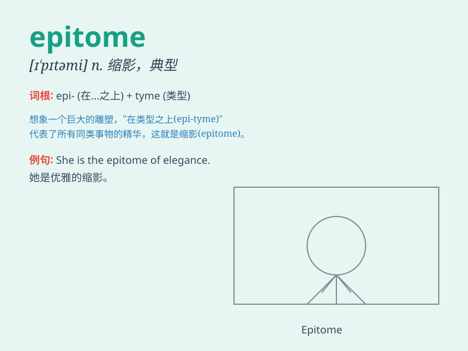

## epitome

**英音:** _[ɪ\'pɪtəmɪ; e-]_ **美音:** _[ɪ\'pɪtəmi]_

**译义:** *n.摘要*

### 短语

+ **the epitome of:** _是...的典型（或典范、缩影）_

+ **epitome of elegance:** _优雅的典范_

+ **epitome of beauty:** _美的典型_

+ **epitome of kindness:** _善良的典范_

+ **epitome of simplicity:** _简单的典型_

### 例句

#### 例句1

> **She is the epitome of kindness and compassion.**

**中文翻译:** 她是善良和同情心的缩影。

**单词释义:** 典范；缩影

#### 例句2

> **This building is the epitome of modern architecture.**

**中文翻译:** 这座建筑是现代建筑的缩影。

**单词释义:** 典型；象征

#### 例句3

> **The small town is the epitome of rural tranquility.**

**中文翻译:** 小镇是乡村宁静的缩影。

**单词释义:** 典型；代表

### 背诵小故事

>
想象一个古老的王国，国王挑选了一位骑士作为勇敢和正义的代表，这位骑士就是整个王国的
epitome。他的行为和品质集中体现了王国所追求的一切美好。

**想象在一个古老王国中，国王挑选的作为勇敢和正义代表的骑士，就是整个王国缩影的故事，以此来辅助记忆'epitome（典型，缩影）'这个单词。**

### 图义

