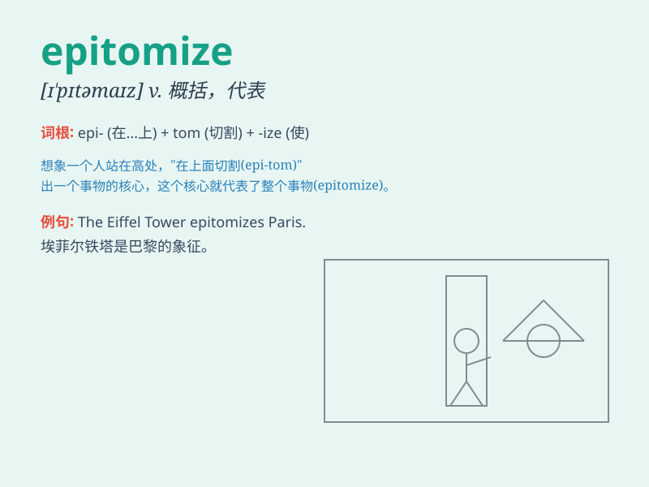

## epitomize

**英音:** _[ɪ\'pɪtəmaɪz; e-]_ **美音:** _[ɪ\'pɪtəmaɪz]_

**译义:** *vt.摘要,概括,成为\...缩影*

### 短语

+ **epitomize the spirit:** _成为精神的典范_

+ **epitomize success:** _是成功的典型_

+ **epitomize beauty:** _是美的典范_

+ **epitomize wisdom:** _是智慧的典型_

+ **epitomize excellence:** _是卓越的典范_

### 例句

#### 例句1

> **The athlete epitomizes determination and hard work.**

**中文翻译:** 这位运动员体现了决心和努力。

**单词释义:** 是\...\...的典型；代表

#### 例句2

> **This painting epitomizes the artist\'s style.**

**中文翻译:** 这幅画集中体现了艺术家的风格。

**单词释义:** 体现；代表

#### 例句3

> **Her success epitomizes what can be achieved through
perseverance.**

**中文翻译:** 她的成功体现了通过坚持不懈可以取得的成就。

**单词释义:** 代表；象征

### 背诵小故事

> A young artist was chosen to epitomize the spirit of the new art
movement. Her works perfectly captured the essence and became the
symbol. Everyone saw in her the best of what the movement stood for.

**一位年轻的艺术家被选中成为新艺术运动精神的缩影。她的作品完美地捕捉到了其精髓并成为了象征。每个人都在她身上看到了该运动的最佳代表。**

### 图义

