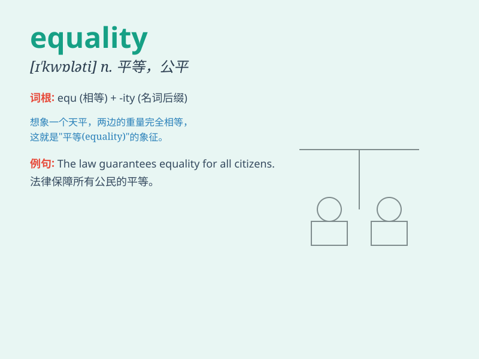

## equality

**英音:** _[ɪ\'kwɒlɪtɪ; iː-]_ **美音:** _[ɪ\'kwɑləti]_

**译义:** *n.等同性,同等,平等,相等,等式*

### 短语

+ **gender equality:** _性别平等_

+ **racial equality:** _种族平等_

+ **equality of opportunity:** _机会均等_

+ **social equality:** _社会平等_

+ **equality before the law:** _法律面前人人平等_

### 例句

#### 例句1

> **We strive for equality between men and women in the
workplace.**

**中文翻译:** 我们致力于在工作场所实现男女平等。

**单词释义:** 平等

#### 例句2

> **The principle of equality is fundamental to a democratic
society.**

**中文翻译:** 平等原则是民主社会的基础。

**单词释义:** 平等

#### 例句3

> **She is a passionate advocate for racial equality.**

**中文翻译:** 她是种族平等的热情倡导者。

**单词释义:** 平等

### 背诵小故事

> In a magical land, all creatures strived for equality. Fairies and
elves worked together, sharing resources and having the same rights.
This land was a symbol of equality, where everyone was treated the same.

**在一片神奇的土地上，所有生物都在为平等而努力。仙女和精灵共同协作，共享资源，拥有相同的权利。这片土地是平等的象征，每个人都受到同等对待。**

### 图义

