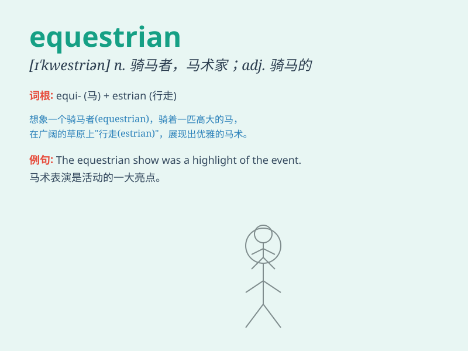

## equestrian

**英音:** _[ɪ\'kwestrɪən; e-]_ **美音:**
_[ɪ\'kwɛstrɪən]_

**译义:**
*adj.骑马的,马的,在马背上的,(古罗马)市民特权阶层成员的,骑士阶层的n.骑手*

### 短语

+ **equestrian event:** _马术比赛_

+ **equestrian sport:** _马术运动_

+ **equestrian center:** _马术中心_

+ **equestrian skills:** _马术技能_

+ **equestrian statue:** _骑马雕像_

### 例句

#### 例句1

> **The equestrian event attracted many spectators.**

**中文翻译:** 马术比赛吸引了众多观众。

**单词释义:** 与马术有关的；骑马的

#### 例句2

> **She is an accomplished equestrian.**

**中文翻译:** 她是一位出色的马术运动员。

**单词释义:** 骑手；骑马者

#### 例句3

> **The equestrian statue stands in the middle of the square.**

**中文翻译:** 广场中央矗立着骑马雕像。

**单词释义:** 与骑马有关的；骑马的

### 背诵小故事

> A brave knight was an excellent equestrian. He spent hours training
on horseback, mastering the art of riding. His equestrian skills helped
him win many battles and become a hero.

**一位勇敢的骑士是出色的骑手。他花了数小时在马背上训练，掌握骑马的艺术。他的骑术帮助他赢得了许多战斗，并成为了英雄。**

### 图义

