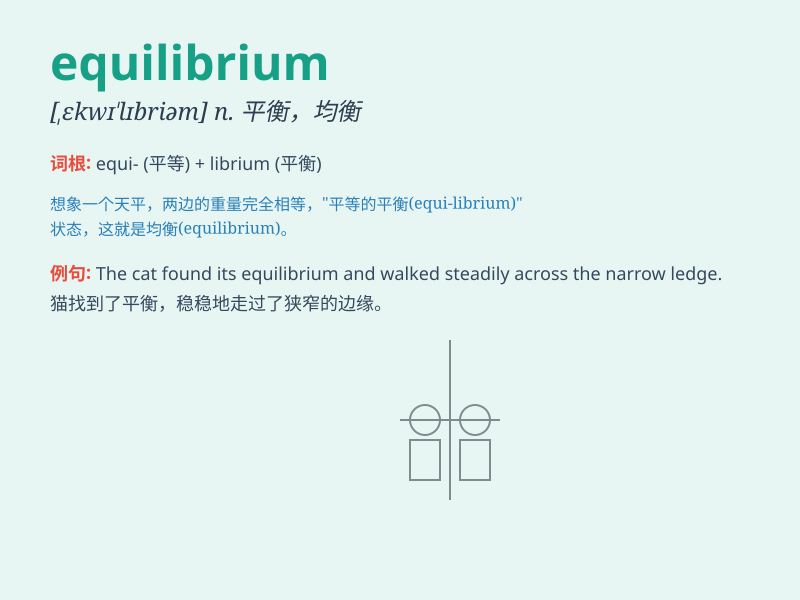

## equilibrium

**英音:** _[,iːkwɪ\'lɪbrɪəm; ,ekwɪ-]_ **美音:**
_[,ikwɪ\'lɪbrɪəm]_

**译义:** *n.平衡,平静,均衡,保持平衡的能力,沉着,安静*

### 短语

+ **dynamic equilibrium:** _动态平衡_

+ **chemical equilibrium:** _化学平衡_

+ **equilibrium price:** _均衡价格_

+ **equilibrium state:** _平衡态_

+ **thermal equilibrium:** _热平衡_

### 例句

#### 例句1

> **The economy is in a state of equilibrium.**

**中文翻译:** 经济处于均衡状态。

**单词释义:** 平衡；均衡

#### 例句2

> **He struggled to maintain his equilibrium on the narrow beam.**

**中文翻译:** 他努力在窄横梁上保持平衡。

**单词释义:** 平衡

#### 例句3

> **The market eventually finds an equilibrium between supply and
demand.**

**中文翻译:** 市场最终在供给和需求之间找到平衡。

**单词释义:** 平衡；均衡

### 背诵小故事

>
想象一个天平，两边的砝码重量相等，天平稳稳地保持水平，没有倾斜。这就像
equilibrium 所表达的平衡状态，一切都稳定、相等、和谐。

**想象一个天平保持水平的场景来理解【equilibrium】所代表的平衡、均衡的意思。**

### 图义

