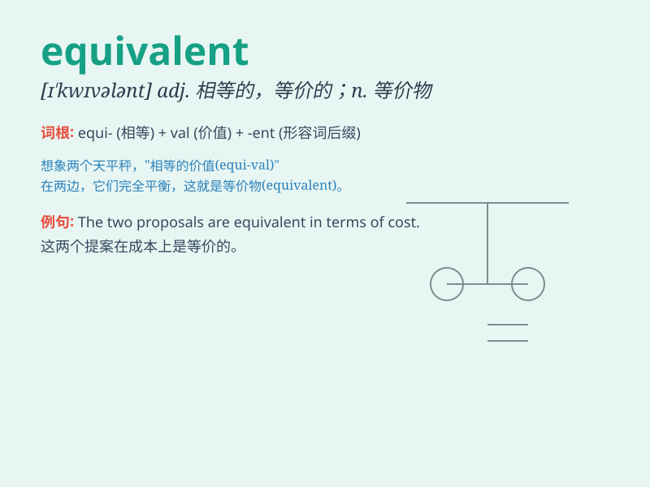

## equivalent

**英音:** _[ɪ\'kwɪv(ə)l(ə)nt]_ **美音:**
_[ɪ\'kwɪvələnt]_

**译义:** *adj.相等的,相当的,同意义的n.等价物,相等物*

### 短语

+ **be equivalent to:** _等于；相当于_

+ **equivalent weight:** _当量_

+ **equivalent circuit:** _等效电路_

+ **equivalent expression:** _等价式；等价表达式_

+ **equivalent stress:** _等效应力_

### 例句

#### 例句1

> **Two cups are equivalent to half a litre.**

**中文翻译:** 两杯相当于半升。

**单词释义:** 相当于；相等的

#### 例句2

> **His job is equivalent to that of a manager.**

**中文翻译:** 他的工作相当于经理的工作。

**单词释义:** 等同的；相等的

#### 例句3

> **This amount of money is equivalent to a month\'s salary for
her.**

**中文翻译:** 这笔钱对于她来说已经相当于一个月的工资了。

**单词释义:** 相当于

### 背诵小故事

>
想象一个魔法世界，有两种神秘的宝石，它们的魔力效果完全相同。这两种宝石就像是
\'equivalent\' 的。就如同在现实中，5 个苹果和 10
个橘子在价值上相等，这就是 \'equivalent\' 的体现。

**想象在魔法世界中两种魔力效果相同的宝石，以及现实中价值相等的水果，来理解\'equivalent（相等的，等价的）\'这个单词**

### 图义

