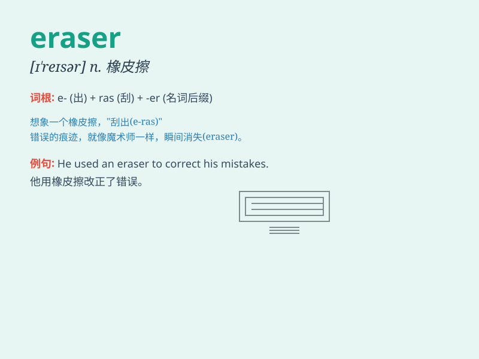

## eraser

**英音:** _[ɪ\'reɪzə]_ **美音:** _[ɪ\'resɚ]_

**译义:** *n.擦除器,尤指墨水消除剂,橡皮*

### 短语

+ **eraser tool:** _橡皮擦工具_

+ **pencil eraser:** _铅笔橡皮_

+ **eraser shavings:** _橡皮屑_

+ **electric eraser:** _电动橡皮擦_

+ **eraser residue:** _橡皮擦残留_

### 例句

#### 例句1

> **I need an eraser to correct my mistakes.**

**中文翻译:** 我需要一块橡皮擦来纠正我的错误。

**单词释义:** 橡皮擦

#### 例句2

> **The eraser on the desk is pink.**

**中文翻译:** 桌子上的橡皮擦是粉红色的。

**单词释义:** 橡皮擦

#### 例句3

> **Can you pass me the eraser, please?**

**中文翻译:** 请把橡皮递给我好吗？

**单词释义:** 橡皮擦

### 背诵小故事

> One day, the little monkey was drawing. But he made a mistake.
Luckily, he had an eraser to rub out the wrong part and make the drawing
perfect. The eraser was like a magic tool to fix mistakes.

**一天，小猴子在画画。但他犯了个错误。幸运的是，他有一块橡皮擦来擦掉错误的部分，让画变得完美。这块橡皮擦就像一个修正错误的神奇工具。**

### 图义

