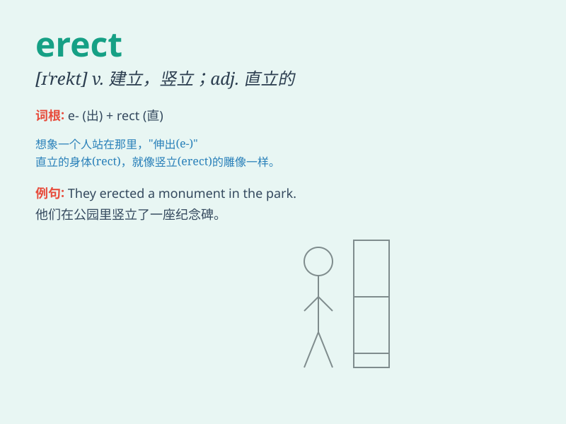

## erect

**英音:** _[ɪ\'rekt]_ **美音:** _[ɪ\'rɛkt]_

**译义:**
*adj.直立的,竖立的,笔直的vt.盖,使竖立,使直立,树立,建立vi.[生理]勃起*

### 短语

+ **erect a building:** _建造一座建筑物_

+ **erect a monument:** _竖立一座纪念碑_

+ **erect a tent:** _搭起一个帐篷_

+ **erect a statue:** _竖立一座雕像_

+ **erect fences:** _竖起栅栏_

### 例句

#### 例句1

> **They erected a statue in the town square.**

**中文翻译:** 他们在城镇广场竖立了一尊雕像。

**单词释义:** 竖立；建造

#### 例句2

> **The soldiers were ordered to stand erect.**

**中文翻译:** 士兵们被命令站直。

**单词释义:** 使直立；挺直

#### 例句3

> **He managed to erect a tent in the storm.**

**中文翻译:** 他设法在暴风雨中搭起了帐篷。

**单词释义:** 搭建；建立

### 背诵小故事

> A strong man was trying to erect a big tent in the wild. He struggled
but finally succeeded. It made him feel proud and confident. Remember,
\'erect\' means to build or set up something upright.

**一个强壮的男人在野外努力搭建一个大帐篷。他费力但最终成功了。这让他感到自豪和自信。记住，\'erect\'意思是建立或竖起某物使其直立。**

### 图义

