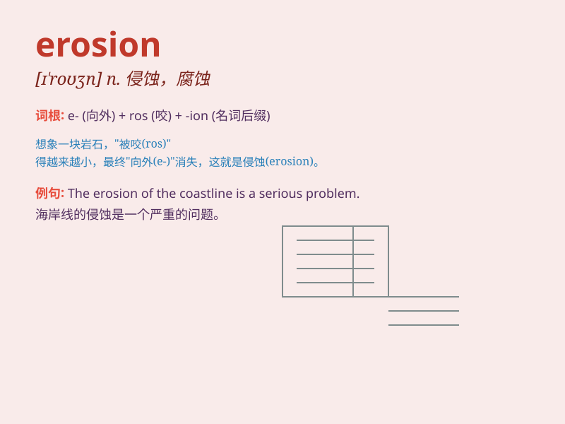

## erosion

**英音:** _[ɪ\'rəʊʒ(ə)n]_ **美音:** _[ɪ\'roʒən]_

**译义:** *n.腐蚀,侵蚀*

### 短语

+ **soil erosion:** _土壤侵蚀_

+ **coastal erosion:** _海岸侵蚀_

+ **erosion control:** _侵蚀控制；防蚀_

+ **wind erosion:** _风蚀_

+ **erosion resistance:** _耐腐蚀性；抗侵蚀性_

### 例句

#### 例句1

> **The erosion of the coastline is a serious problem.**

**中文翻译:** 海岸线的侵蚀是一个严重的问题。

**单词释义:** 侵蚀

#### 例句2

> **Soil erosion can lead to the loss of fertile land.**

**中文翻译:** 水土流失会导致肥沃土地的丧失。

**单词释义:** 侵蚀

#### 例句3

> **The erosion of traditional values is a concern in modern
society.**

**中文翻译:** 传统价值观的侵蚀是现代社会令人担忧的问题。

**单词释义:** 逐渐消失；削弱

### 背诵小故事

>
想象一下，有一座美丽的小山，山上长满了绿草和鲜花。但是，每年的狂风暴雨不断冲击着它，慢慢地，泥土和石头被带走，山体变小了。这就是
erosion（侵蚀），自然力量对物体的逐渐破坏。

**想象有座小山，每年被风雨冲击，泥土石头被带走山体变小，这就是'侵蚀'，即自然力量对物体的逐渐破坏。**

### 图义

