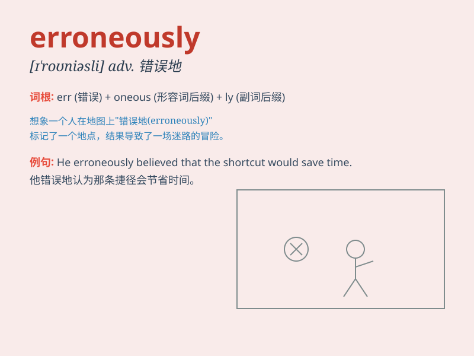

## erroneously

**英音:** _null_ **美音:** _null_

**译义:** *null*

### 短语

+ **erroneously assume:** _错误地假定_

+ **erroneously believe:** _错误地相信_

+ **erroneously claim:** _错误地宣称_

+ **erroneously interpret:** _错误地解释_

+ **erroneously diagnose:** _错误地诊断_

### 例句

#### 例句1

> **The report was erroneously attributed to the wrong author.**

**中文翻译:** 这份报告被错误地归于错误的作者。

**单词释义:** 错误地

#### 例句2

> **He was erroneously believed to be the culprit.**

**中文翻译:** 他被错误地认为是罪魁祸首。

**单词释义:** 错误地

#### 例句3

> **The information was erroneously recorded in the system.**

**中文翻译:** 这些信息被错误地记录在系统中。

**单词释义:** 错误地

### 背诵小故事

> A detective was wrongly accused of a crime. He was judged
erroneously. But with his perseverance, he finally proved his innocence.
This shows that being judged erroneously can be very unfair.

**一位侦探被错误地指控犯罪。他被错误地判定了。但凭借他的毅力，他最终证明了自己的清白。这表明被错误地判定是非常不公平的。**

### 图义

