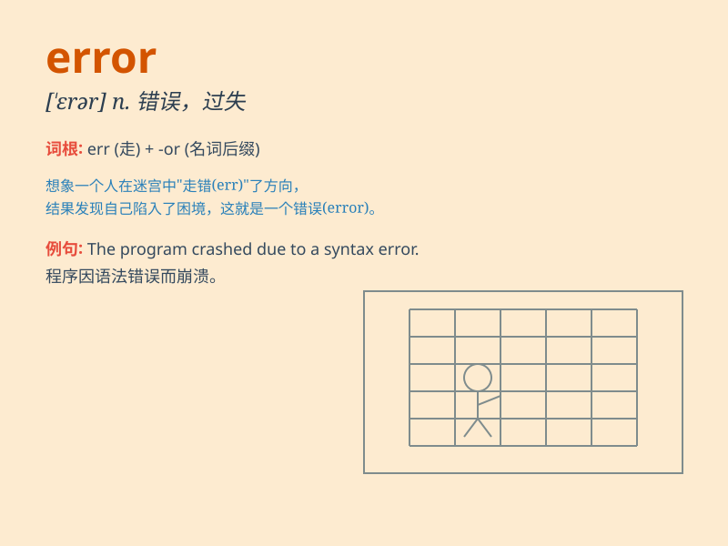

## error

**英音:** _[\'erə]_ **美音:** _[\'ɛrɚ]_

**译义:** *n.错误,过失,误差*

### 短语

+ **in error:** _错误地；弄错地_

+ **error message:** _错误信息_

+ **human error:** _人为错误_

+ **system error:** _系统错误_

+ **trial and error:** _反复试验；不断摸索_

### 例句

#### 例句1

> **There is an error in your calculation.**

**中文翻译:** 您的计算有错误。

**单词释义:** 错误

#### 例句2

> **The computer system keeps showing errors.**

**中文翻译:** 计算机系统不断显示错误。

**单词释义:** 错误；差错

#### 例句3

> **He admitted his error and apologized.**

**中文翻译:** 他承认了自己的错误并道歉。

**单词释义:** 错误

### 背诵小故事

> One day, Tom was doing his math homework. He thought he was correct,
but when the teacher checked, she found many errors. Tom realized that
being careful is very important to avoid errors.

**一天，汤姆在做数学作业。他以为自己是对的，但老师检查时，发现了很多错误。汤姆意识到小心谨慎对于避免错误是非常重要的。**

### 图义

