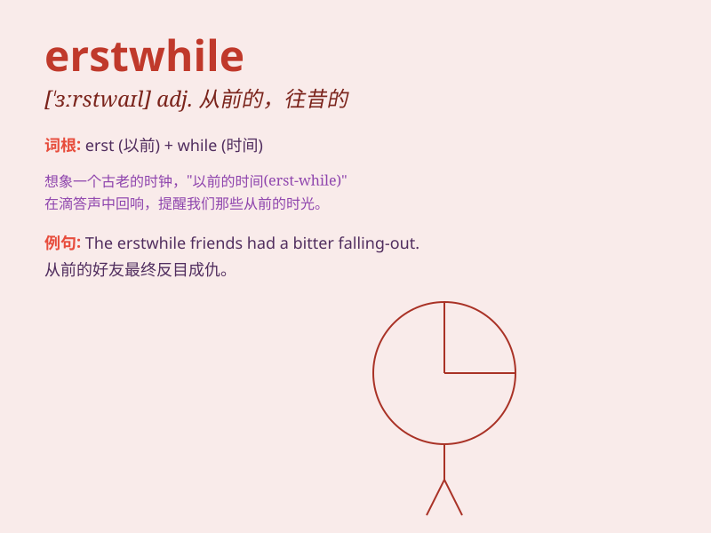

## erstwhile

**英音:** _[\'ɜːstwaɪl]_ **美音:** _[\'ɝstwaɪl]_

**译义:** *adv.\<古>以前,往昔地adj.以前的,往昔的*

### 短语

+ **erstwhile friend:** _以前的朋友_

+ **erstwhile lover:** _昔日的恋人_

+ **erstwhile glory:** _往昔的荣耀_

+ **erstwhile home:** _过去的家_

+ **erstwhile position:** _从前的职位_

### 例句

#### 例句1

> **The erstwhile friends had a falling out over a business deal.**

**中文翻译:** 昔日的朋友因一笔生意发生争吵。

**单词释义:** 以前的；往昔的

#### 例句2

> **He was the erstwhile leader of the party.**

**中文翻译:** 他是该党的前任领导人。

**单词释义:** 以前的；过去的

#### 例句3

> **The erstwhile peaceful town has now become a bustling city.**

**中文翻译:** 昔日宁静的小镇，如今变成了繁华的都市。

**单词释义:** 往昔的；过去的

### 背诵小故事

>
曾经有个名叫汤姆的人，他erstwhile（往昔的）生活非常富裕，但因投资失败变得贫穷。他时常回忆起erstwhile的美好时光，激励自己重新振作。

**曾经有个叫汤姆的人，他往昔的生活很富裕，但因投资失败变穷了。他常回忆往昔美好时光，激励自己重新振作。**

### 图义

