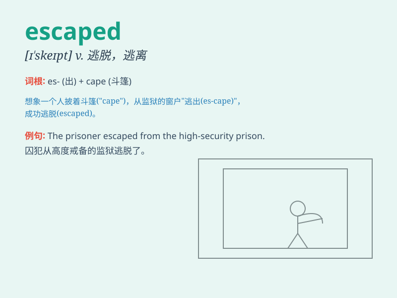

## escaped

**英音:** _[ɪˈskeɪpt]_ **美音:** _[ɪˈskeɪpt]_

**译义:** *v.
逃跑；逃脱；逃避；避开；（气体、液体等）漏出；被遗忘；未被注意 adj.
逃跑了的；逃脱了的*

### 短语

+ **escaped prisoner:** _逃犯_

+ **escaped criminal:** _在逃罪犯_

+ **escaped gas:** _泄漏的气体_

+ **escaped slave:** _逃跑的奴隶_

+ **escaped notice:** _未被注意到_

### 例句

#### 例句1

> **The prisoner escaped from the jail.**

**中文翻译:** 这名囚犯从监狱逃走了。

**单词释义:** 逃走

#### 例句2

> **She escaped unhurt when the car crashed.**

**中文翻译:** 汽车撞毁时她逃过一劫，没有受伤。

**单词释义:** 逃脱

#### 例句3

> **The smell of gas escaped.**

**中文翻译:** 煤气漏出来了。

**单词释义:** 泄漏

### 背诵小故事

> A thief was being chased by the police. But luckily, he found a
hidden passage and escaped. The police looked everywhere but couldn\'t
find him. \'Escaped\' means to get away from a dangerous or unpleasant
situation.

**一个小偷正被警察追捕。但幸运的是，他找到了一个隐藏的通道并逃走了。警察到处找但没找到他。\'escaped\'意思是从危险或不愉快的处境中离开。**

### 图义

