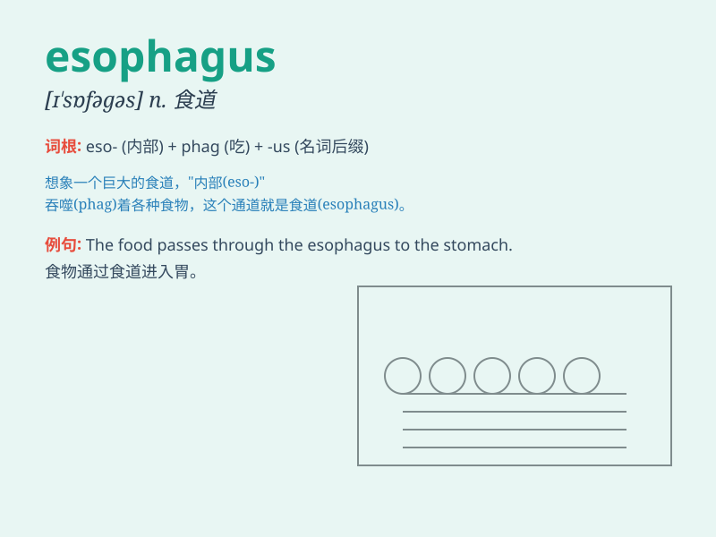

## esophagus

**英音:** _[iː\'sɒfəɡəs]_ **美音:** _[ɪ\'sɑfəɡəs]_

**译义:** *n.食道*

### 短语

+ **esophageal cancer:** _食管癌_

+ **esophageal stricture:** _食管狭窄_

+ **esophageal sphincter:** _食管括约肌_

+ **esophageal varices:** _食管静脉曲张_

+ **esophageal motility disorder:** _食管动力障碍_

### 例句

#### 例句1

> **The food travels down the esophagus to the stomach.**

**中文翻译:** 食物沿着食道到达胃。

**单词释义:** 食道

#### 例句2

> **An ulcer in the esophagus can cause severe pain.**

**中文翻译:** 食道溃疡会引起剧烈疼痛。

**单词释义:** 食道

#### 例句3

> **Doctors need to examine the esophagus to diagnose the
problem.**

**中文翻译:** 医生需要检查食道来诊断问题。

**单词释义:** 食道

### 背诵小故事

>
想象一下，一个勇敢的探险家在探索神秘洞穴时，发现了一条像管道一样的通道，他称之为
\'esophagus\' 。这个通道就像食物从嘴巴到胃的神奇旅程之路。

**想象一个勇敢的探险家在洞穴中发现像食物从嘴到胃的通道，并称之为食管（esophagus）**

### 图义

