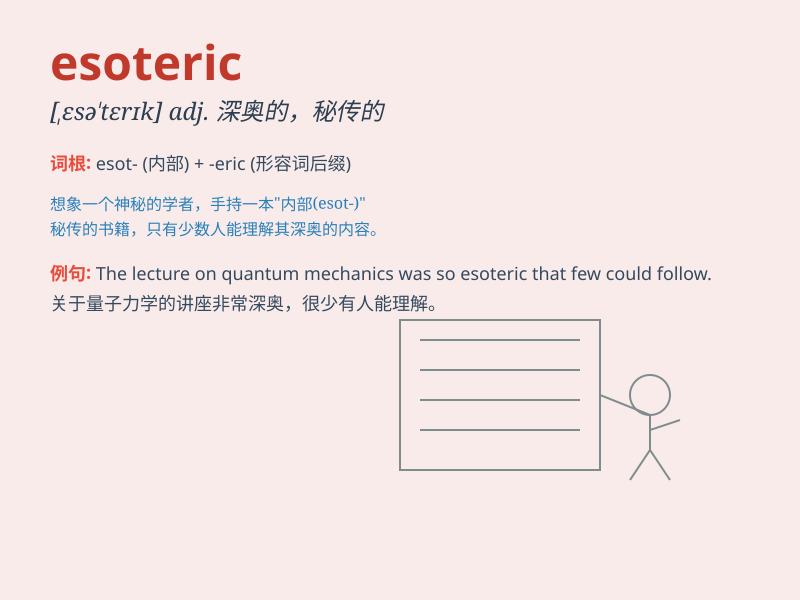

## esoteric

**英音:** _[,esə\'terɪk; ,iːsə-]_ **美音:**
_[,ɛsə\'tɛrɪk]_

**译义:** *adj.深奥*

### 短语

+ **esoteric knowledge:** _深奥的知识_

+ **esoteric doctrine:** _秘传的教义_

+ **esoteric practices:** _神秘的做法_

+ **esoteric subject:** _晦涩的学科_

+ **esoteric teachings:** _深奥的教诲_

### 例句

#### 例句1

> **The professor\'s lecture on esoteric philosophy left many
students confused.**

**中文翻译:** 教授深奥的哲学讲座让许多学生感到困惑。

**单词释义:** 深奥的；难以理解的

#### 例句2

> **She is interested in esoteric knowledge such as astrology and
tarot.**

**中文翻译:** 她对占星术、塔罗牌等深奥知识感兴趣。

**单词释义:** 神秘的；秘密的

#### 例句3

> **The book contains some esoteric theories that are only accessible
to experts.**

**中文翻译:** 这本书包含一些只有专家才能理解的深奥理论。

**单词释义:** 只有内行才懂的；难领略的

### 背诵小故事

> A young adventurer was lost in a hidden cave. There, he found ancient
writings that were esoteric. No one but him could understand their deep
and mysterious meanings. It was like a secret code only he could crack.

**一位年轻的冒险家在一个隐藏的洞穴中迷路了。在那里，他发现了一些深奥的古代文字。除了他，没有人能理解它们深刻而神秘的含义。这就像只有他能破解的密码。**

### 图义

