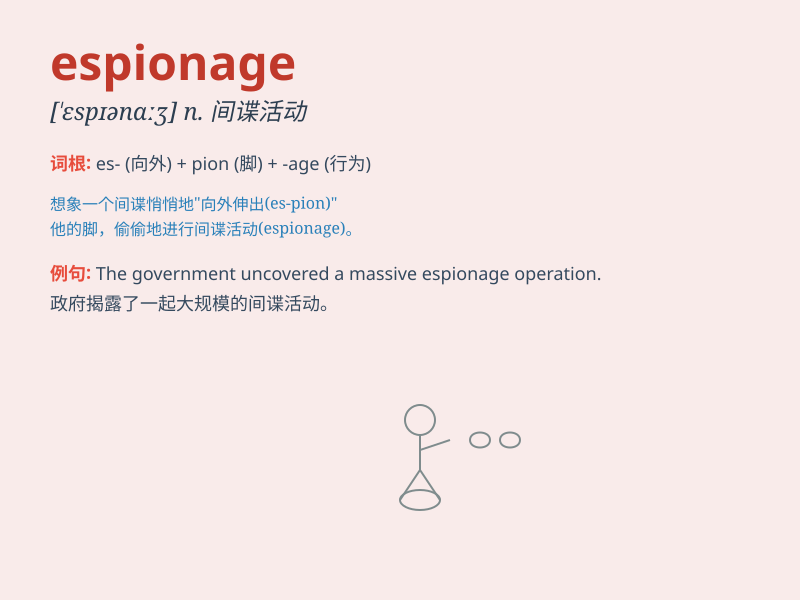

## espionage

**英音:** _[\'espɪənɑːʒ; -ɪdʒ]_ **美音:** _[\'ɛspɪənɑʒ]_

**译义:** *n.间谍,侦探*

### 短语

+ **industrial espionage:** _工业间谍活动_

+ **economic espionage:** _经济间谍活动_

+ **espionage agent:** _间谍特工_

+ **espionage network:** _间谍网_

+ **engage in espionage:** _从事间谍活动_

### 例句

#### 例句1

> **The government uncovered a major espionage operation against the
country.**

**中文翻译:** 政府揭露了一起针对该国的重大间谍活动。

**单词释义:** 间谍活动；谍报活动

#### 例句2

> **He was accused of espionage and sentenced to prison.**

**中文翻译:** 他被指控犯有间谍罪并被判入狱。

**单词释义:** 间谍活动

#### 例句3

> **The company suspected that it was a victim of industrial
espionage.**

**中文翻译:** 该公司怀疑自己是工业间谍活动的受害者。

**单词释义:** 间谍活动

### 背诵小故事

> A spy was caught in a foreign country for espionage. He tried to
steal important secrets but was finally discovered. Remember, espionage
means the act of spying and getting secret information illegally.

**一名间谍因从事间谍活动在外国被抓。他试图窃取重要机密，但最终被发现。记住，espionage
意思是间谍活动以及非法获取秘密信息的行为。**

### 图义

