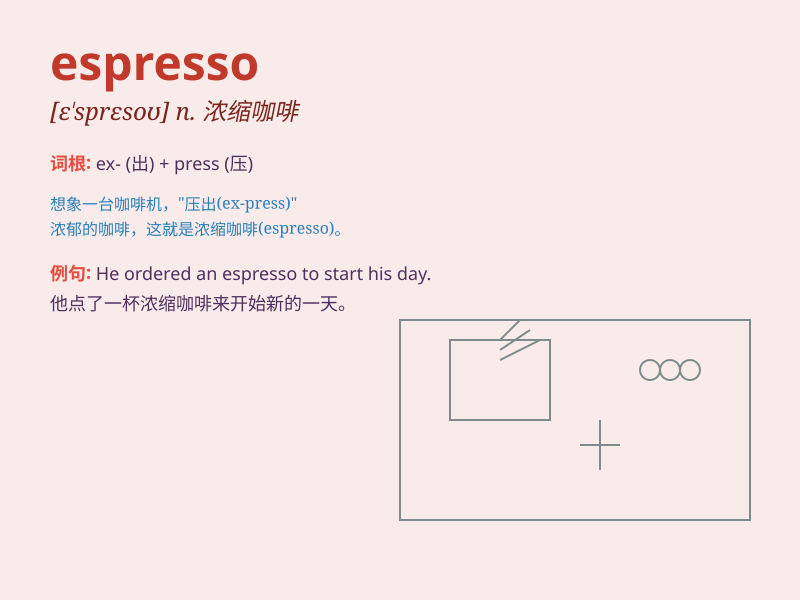

## espresso

**英音:** _[e\'spresəʊ]_ **美音:** _[eˈspresoʊ]_

**译义:** *n.(蒸汽加压煮出的)浓咖啡*

### 短语

+ **espresso coffee:** _意式浓缩咖啡_

+ **espresso machine:** _意式浓缩咖啡机_

+ **double espresso:** _双份意式浓缩咖啡_

+ **single espresso:** _单份意式浓缩咖啡_

+ **espresso shot:** _一份意式浓缩咖啡_

### 例句

#### 例句1

> **I always start my day with a cup of espresso.**

**中文翻译:** 我总是以一杯浓缩咖啡开始新的一天。

**单词释义:** 意式浓缩咖啡

#### 例句2

> **The barista made me a perfect espresso.**

**中文翻译:** 咖啡师为我调制了一杯完美的浓缩咖啡。

**单词释义:** 意式浓缩咖啡

#### 例句3

> **She ordered an espresso instead of a latte.**

**中文翻译:** 她点了一杯浓缩咖啡而不是拿铁。

**单词释义:** 意式浓缩咖啡

### 背诵小故事

>
想象一下，一位疲惫的旅行者在意大利的街头，急需一杯能量饮品。他走进一家咖啡店，急切地说：\'I
need an espresso!\' 店员迅速为他端上一杯香浓的浓缩咖啡。espresso
就是这种浓郁提神的咖啡。

**想象一位疲惫的旅行者在意大利街头要浓缩咖啡的情景来记住 espresso
这个单词，意为浓缩咖啡**

### 图义

