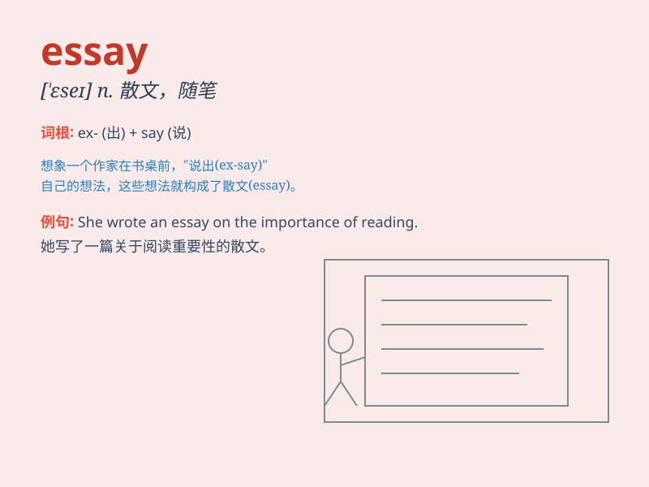

## essay

**英音:** _[\'eseɪ]_ **美音:** _[\'ɛse]_

**译义:** *vt.企图,尝试n.企图,散文,小品文,随笔,短文,评论*

### 短语

+ **essay writing:** _论文写作_

+ **critical essay:** _评论性文章_

+ **persuasive essay:** _劝说性文章_

+ **essay question:** _论述题_

+ **expository essay:** _说明文_

### 例句

#### 例句1

> **She wrote an excellent essay on Shakespeare\'s tragedies.**

**中文翻译:** 她写了一篇关于莎士比亚悲剧的优秀文章。

**单词释义:** 文章；短文

#### 例句2

> **The student is struggling to finish his history essay by the
deadline.**

**中文翻译:** 该学生正在努力在截止日期前完成他的历史论文。

**单词释义:** 论文；作文

#### 例句3

> **He attempted to essay a difficult climb up the mountain.**

**中文翻译:** 他试图尝试一次艰难的爬山之旅。

**单词释义:** 尝试；试图

### 背诵小故事

> 小明参加写作比赛，老师告诉他要写一篇
essay。小明很紧张，但他想到可以把自己的冒险经历写进去。经过努力，他完成了一篇精彩的
essay，最终获得了大奖。

**小明参加写作比赛，老师让他写一篇短文。小明很紧张，但他想到可以把自己的冒险经历写进去。经过努力，他完成了一篇精彩的短文，最终获得了大奖。**

### 图义

