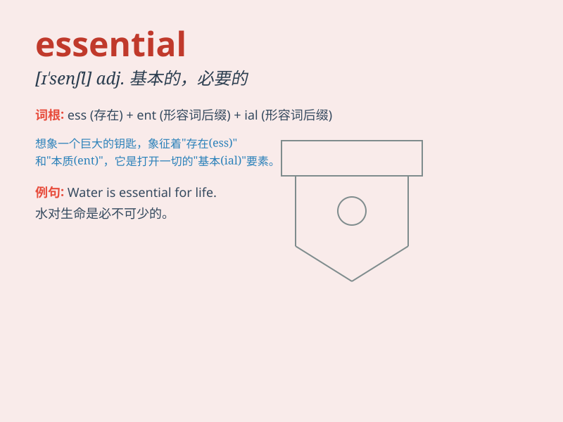

## essential

**英音:** _[ɪ\'senʃ(ə)l]_ **美音:** _[ɪ\'sɛnʃl]_

**译义:**
*adj.本质的,实质的,基本的,提炼的,精华的n.本质,实质,要素,要点*

### 短语

+ **essential element:** _基本要素_

+ **essential condition:** _必要条件_

+ **essential feature:** _本质特征_

+ **essential service:** _基本服务_

+ **be essential for:** _对\...\...必不可少_

### 例句

#### 例句1

> **Water is essential for life.**

**中文翻译:** 水是生命所必需的。

**单词释义:** 必不可少的

#### 例句2

> **It is essential to follow the safety rules.**

**中文翻译:** 遵守安全规则至关重要。

**单词释义:** 至关重要的

#### 例句3

> **The essential ingredients for this cake are flour, sugar and
eggs.**

**中文翻译:** 这个蛋糕的主要成分是面粉、糖和鸡蛋。

**单词释义:** 基本的

### 背诵小故事

> 想象你在沙漠中迷路，没有水和食物。这时，找到水源就变得 ESSENTIAL
了，因为它是生存必不可少的。没有水，就无法活下去。所以 essential
就是指极其重要、必不可少的东西。

**想象你在沙漠中迷路，没有水和食物。这时，找到水源就变得极其重要、必不可少了，因为它是生存所必需的。没有水，就无法活下去。所以
essential 就是指极其重要、必不可少的东西。**

### 图义

