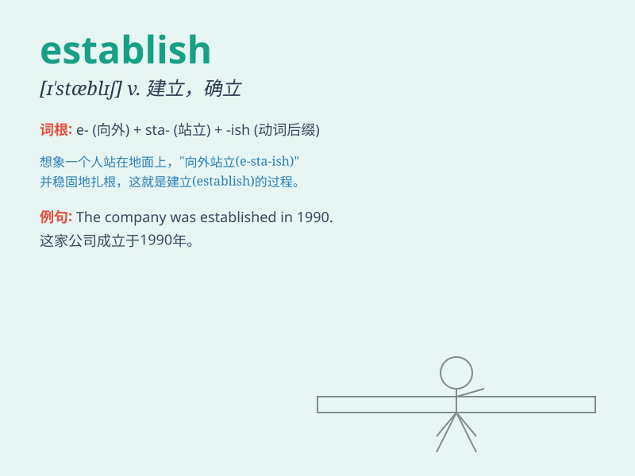

## establish

**英音:** _[ɪ\'stæblɪʃ; e-]_ **美音:** _[ɪˈstæblɪʃ]_

**译义:** *vt.建立,设立,安置,使定居,使人民接受,确定v.建立*

### 短语

+ **establish oneself:** _立足；确立地位；成名_

+ **establish contact:** _建立联系_

+ **establish a business:** _创业；开办企业_

+ **establish relations:** _建立关系_

+ **establish credibility:** _树立信誉_

### 例句

#### 例句1

> **The company was established in 1980.**

**中文翻译:** 公司成立于1980年。

**单词释义:** 成立；建立

#### 例句2

> **He has established a good reputation for himself as a reliable
worker.**

**中文翻译:** 他为自己树立了可靠工人的良好声誉。

**单词释义:** 树立；确立

#### 例句3

> **The research aims to establish the link between diet and
health.**

**中文翻译:** 该研究旨在建立饮食与健康之间的联系。

**单词释义:** 确定；证实

### 背诵小故事

> A group of brave pioneers wanted to create a new settlement. They
worked hard to establish houses, roads, and a farm. Finally, they built
a wonderful community. They truly established a new home.

**一群勇敢的开拓者想要创建一个新的定居点。他们努力建造房屋、道路和农场。最终，他们建立了一个很棒的社区。他们真的成功建立了一个新家。**

### 图义

