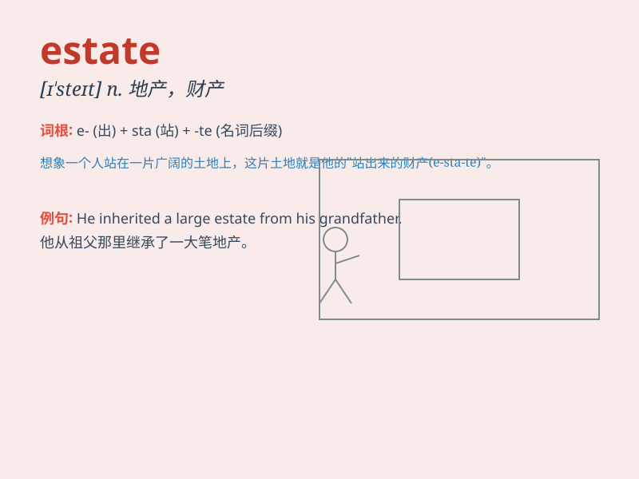

## estate

**英音:** _[ɪ\'steɪt; e-]_ **美音:** _[ɪ\'stet]_

**译义:** *n.状态,不动产,时期,阶层,财产*

### 短语

+ **real estate:** _房地产；不动产_

+ **estate agent:** _房地产经纪人_

+ **estate car:** _旅行轿车；客货两用轿车_

+ **estate tax:** _（美）房地产遗产税_

+ **industrial estate:** _工业区_

### 例句

#### 例句1

> **He inherited a large estate from his father.**

**中文翻译:** 他从父亲那里继承了一大笔遗产。

**单词释义:** 遗产

#### 例句2

> **The estate agent showed us several houses.**

**中文翻译:** 房地产经纪人带我们看了几栋房子。

**单词释义:** 房地产

#### 例句3

> **The estate was surrounded by beautiful gardens.**

**中文翻译:** 该庄园周围环绕着美丽的花园。

**单词释义:** 庄园

### 背诵小故事

> A poor man dreamed of having an estate. One day, he found a magical
key that led him to a huge estate with a beautiful garden and a big
house. He became the owner and lived happily ever after.

**一个穷人梦想拥有一处房产。有一天，他发现了一把神奇的钥匙，这把钥匙带他找到了一个有着美丽花园和大房子的巨大房产。他成为了主人，从此过上了幸福的生活。**

### 图义

