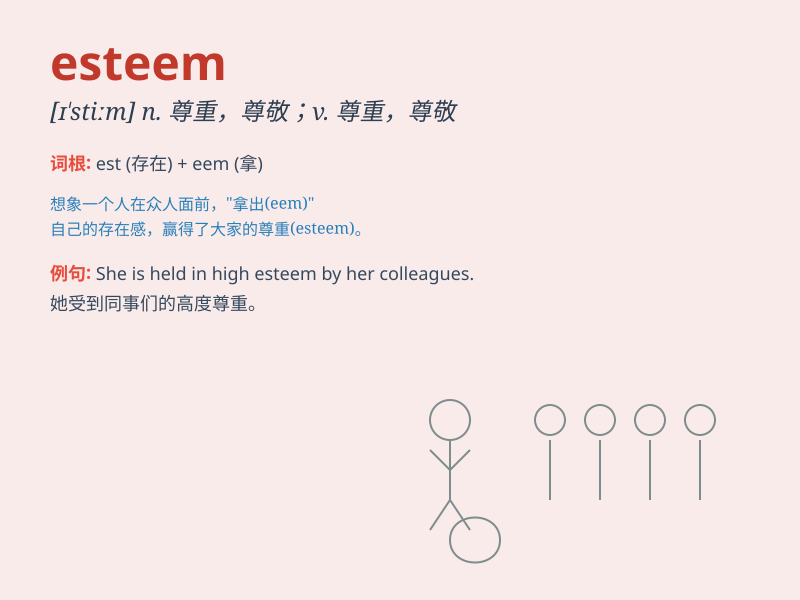

## esteem

**英音:** _[ɪ\'stiːm; e-]_ **美音:** _[ɪ\'stim]_

**译义:** *vt.把\...看作,尊敬,尊重,认为n.尊敬,尊重*

### 短语

+ **hold in high esteem:** _非常尊重；敬重_

+ **self-esteem:** _自尊；自尊心_

+ **esteem for:** _对\...\...的尊重_

+ **lose esteem:** _失去尊重_

+ **gain esteem:** _获得尊重_

### 例句

#### 例句1

> **I have great esteem for her achievements.**

**中文翻译:** 我非常尊重她的成就。

**单词释义:** 敬重

#### 例句2

> **She is held in high esteem by her colleagues.**

**中文翻译:** 她深受同事们的尊敬。

**单词释义:** 敬重；尊重

#### 例句3

> **The public esteem for the scientist has grown in recent
years.**

**中文翻译:** 近年来，公众对这位科学家的尊重与日俱增。

**单词释义:** 尊重

### 背诵小故事

> Imagine a young artist who constantly doubts his skills. But one day,
a famous critic praises his work highly, giving him esteem. The artist
realizes his worth and starts believing in himself. From then on, he
holds his art in high esteem.

**想象一位年轻艺术家一直怀疑自己的技能。但有一天，一位著名评论家高度赞扬他的作品，给予他尊重。这位艺术家意识到自己的价值，开始相信自己。从那时起，他非常尊重自己的艺术。**

### 图义

