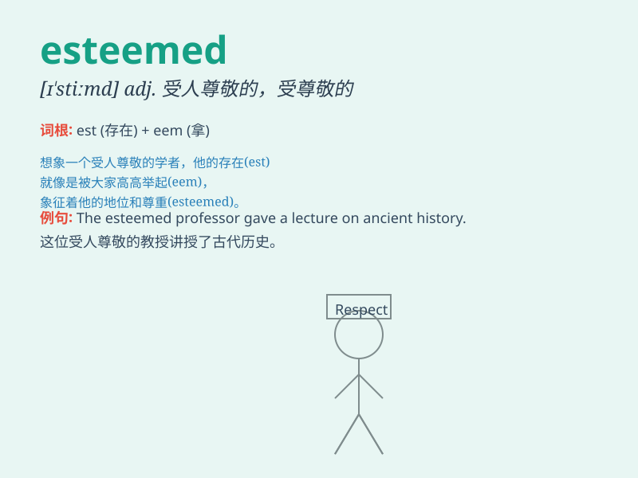

## esteemed

**英音:** _[ɪˈstiːmd]_ **美音:** _[ɪˈstiːmd]_

**译义:**
*adj.受人尊敬的；被敬重的；被认为重要的；受推崇的；v.尊重；敬重；把...看作；认为*

### 短语

+ **esteemed friend:** _尊敬的朋友_

+ **highly esteemed:** _备受尊崇的_

+ **esteemed guest:** _尊贵的客人_

+ **esteemed position:** _令人尊敬的职位_

+ **widely esteemed:** _广受尊敬的_

### 例句

#### 例句1

> **He is an esteemed professor in the field of physics.**

**中文翻译:** 他是物理学领域一位受人尊敬的教授。

**单词释义:** 受人尊敬的

#### 例句2

> **The esteemed guests were welcomed with great enthusiasm.**

**中文翻译:** 尊贵的客人们受到了热烈的欢迎。

**单词释义:** 尊贵的

#### 例句3

> **She has an esteemed reputation for her work in charity.**

**中文翻译:** 她因在慈善工作中的表现而享有崇高的声誉。

**单词释义:** 崇高的；令人敬仰的

### 背诵小故事

> A young artist was seeking recognition. One day, he met an esteemed
master. The master praised his work, saying it was of high quality. The
young artist was thrilled and understood that being esteemed means
highly respected and admired.

**一位年轻的艺术家正在寻求认可。有一天，他遇到了一位受人尊敬的大师。大师称赞他的作品，说质量很高。年轻的艺术家很激动，并明白了
esteemed 意味着备受尊敬和钦佩。**

### 图义

