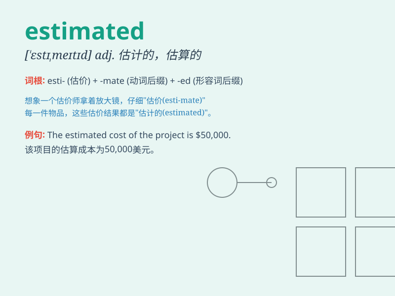

## estimated

**英音:** _[ˈestɪmeɪtɪd]_ **美音:** _[ˈestɪmətɪd]_

**译义:** *adj. 估计的，估算的；v. 估计，估价（estimate
的过去式及过去分词形式）*

### 短语

+ **estimated cost:** _估计成本_

+ **estimated time:** _预计时间_

+ **estimated value:** _估计价值_

+ **estimated revenue:** _估计收入_

+ **estimated distance:** _估计距离_

### 例句

#### 例句1

> **The estimated cost of the project is \$100,000.**

**中文翻译:** 这个项目的预估成本是 10 万美元。

**单词释义:** 预估的

#### 例句2

> **The estimated time of arrival is 5 p.m.**

**中文翻译:** 预计到达时间是下午 5 点。

**单词释义:** 预计的

#### 例句3

> **We have an estimated 500 guests attending the event.**

**中文翻译:** 我们估计有 500 位客人参加这个活动。

**单词释义:** 估计的

### 背诵小故事

> A group of explorers were lost in the forest. They estimated that it
would take at least three days to find the way out. But with their
determination, they finally succeeded earlier than estimated.

**一群探险家在森林中迷路了。他们估计至少需要三天才能找到出路。但凭借决心，他们最终比估计的更早成功了。**

### 图义

