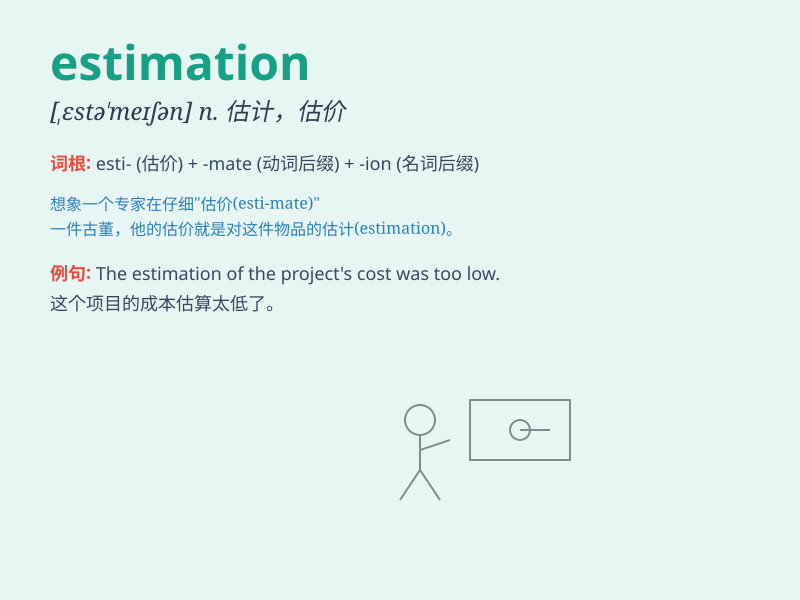

## estimation

**英音:** _[estɪ\'meɪʃ(ə)n]_ **美音:** _[,ɛstɪ\'meʃən]_

**译义:** *n.估计,预算,评价,判断,尊重*

### 短语

+ **in one\'s estimation:** _据某人估计_

+ **make an estimation:** _做出估计_

+ **rough estimation:** _粗略估计_

+ **accurate estimation:** _准确估计_

+ **cost estimation:** _成本估计_

### 例句

#### 例句1

> **In my estimation, the project will take at least six months to
complete.**

**中文翻译:** 据我估计，该项目至少需要六个月才能完成。

**单词释义:** 看法；估计

#### 例句2

> **The estimation of the damage caused by the storm is still
ongoing.**

**中文翻译:** 对风暴造成的损失的估计仍在进行中。

**单词释义:** 估计；估算

#### 例句3

> **His estimation of her abilities was overly optimistic.**

**中文翻译:** 他对她能力的估计过于乐观了。

**单词释义:** 评价；判断

### 背诵小故事

> A scientist was conducting an experiment. People were waiting for the
result with anticipation. Finally, the scientist gave an estimation
based on the data. It was an important step towards the truth.

**一位科学家正在进行一项实验。人们满怀期待地等待结果。最后，科学家根据数据给出了一个估计。这是迈向真相的重要一步。**

### 图义

