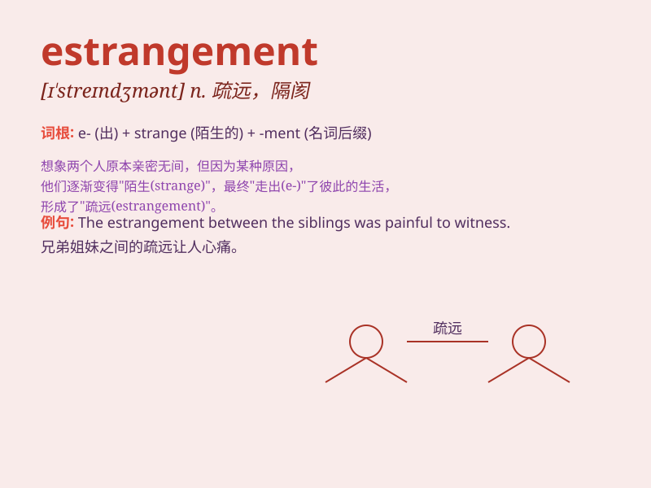

## estrangement

**英音:** _[ɪ\'streɪn(d)ʒm(ə)nt; e-]_ **美音:**
_[ɪ\'strendʒmənt]_

**译义:** *n.疏远*

### 短语

+ **emotional estrangement:** _情感上的疏远_

+ **family estrangement:** _家庭关系的疏远_

+ **marital estrangement:** _婚姻关系的疏远_

+ **social estrangement:** _社会关系的疏远_

+ **gradual estrangement:** _逐渐的疏远_

### 例句

#### 例句1

> **The estrangement between the two friends was caused by a
misunderstanding.**

**中文翻译:** 两个朋友之间的隔阂是因为一次误会而产生的。

**单词释义:** 隔阂；疏远

#### 例句2

> **His long absence led to the estrangement of his family.**

**中文翻译:** 他的长期缺席导致了家人的疏远。

**单词释义:** 疏远；失和

#### 例句3

> **The estrangement from her parents was a source of great pain for
her.**

**中文翻译:** 与父母的疏远给她带来了巨大的痛苦。

**单词释义:** 疏远；隔离

### 背诵小故事

> A man was once close with his friends. But due to misunderstandings
and lack of communication, they grew apart. This distance and
unfamiliarity was the estrangement that changed their relationship.

**一个男人曾经和他的朋友们关系亲密。但由于误解和缺乏交流，他们逐渐疏远。这种距离和陌生感就是使他们关系改变的隔阂。**

### 图义

