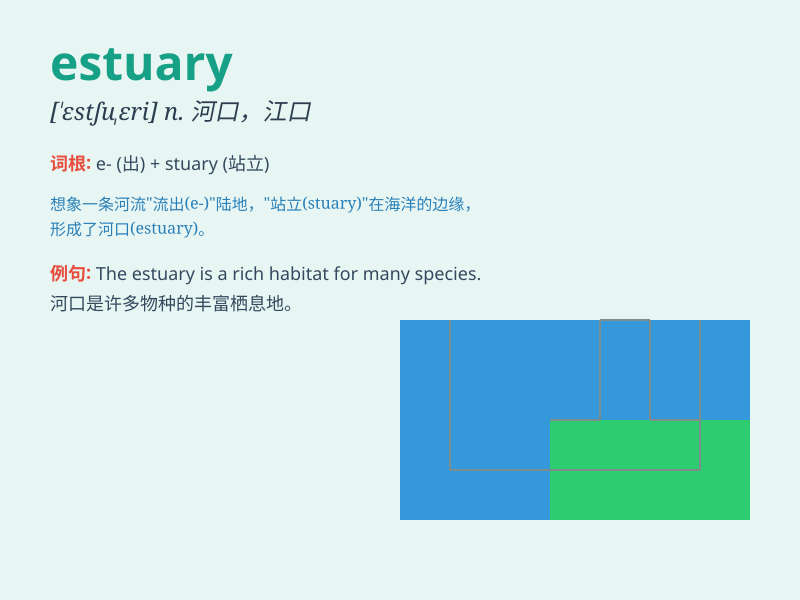

## estuary

**英音:** _[\'estjʊ(ə)rɪ]_ **美音:** _[\'ɛstʃʊ\'ɛri]_

**译义:** *n.河口,江口*

### 短语

+ **estuary deposit:** _河口沉积_

+ **estuary environment:** _河口环境_

+ **estuary fishing:** _河口捕鱼_

+ **estuary navigation:** _河口航行_

+ **estuary ecosystem:** _河口生态系统_

### 例句

#### 例句1

> **The estuary is a rich habitat for many species of birds.**

**中文翻译:** 河口是许多鸟类的丰富栖息地。

**单词释义:** 河口

#### 例句2

> **We went fishing in the estuary at sunset.**

**中文翻译:** 日落时分，我们去河口钓鱼。

**单词释义:** 河口

#### 例句3

> **The estuary was polluted by industrial waste.**

**中文翻译:** 河口被工业废物污染。

**单词释义:** 河口

### 背诵小故事

> A little fish was lost in a big place. It swam and swam until it
reached the estuary. There, the water was a mix of fresh and salt. It
was a special place where rivers met the sea. The little fish finally
found its way home.

**一条小鱼在一个大地方迷路了。它游啊游，直到到达河口。在那里，水是淡水和盐水的混合。这是河流与大海交汇的特殊地方。小鱼终于找到了回家的路。**

### 图义

