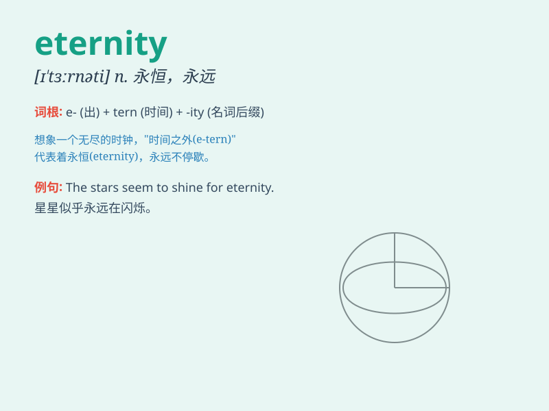

## eternity

**英音:** _[ɪ\'tɜːnɪtɪ; iː-]_ **美音:** _[ɪ\'tɝnəti]_

**译义:** *n.永远,来世,不朽,来世,来生*

### 短语

+ **for eternity:** _永远；永恒_

+ **in eternity:** _在永恒中_

+ **eternity ring:** _永恒戒指；永恒指环_

+ **eternity love:** _永恒的爱_

+ **through eternity:** _贯穿永恒；历经永恒_

### 例句

#### 例句1

> **Love is said to last for eternity.**

**中文翻译:** 据说爱情是永恒的。

**单词释义:** 永恒；永远；不朽

#### 例句2

> **The promise of eternity is comforting.**

**中文翻译:** 永恒的应许令人安慰。

**单词释义:** 永恒；永远

#### 例句3

> **He contemplated the concept of eternity.**

**中文翻译:** 他思考着永恒的概念。

**单词释义:** 永恒；永远

### 背诵小故事

> A brave knight sought the key to eternity. After many trials, he
found a magical cave. Inside, a wise old wizard told him that true
eternity lies in the love and kindness we share. The knight understood
and spread love ever after.

**一位勇敢的骑士寻找永恒的钥匙。经过多次考验，他发现了一个神奇的洞穴。在里面，一位睿智的老巫师告诉他，真正的永恒在于我们分享的爱和善良。骑士明白了，并从此传播爱。**

### 图义

