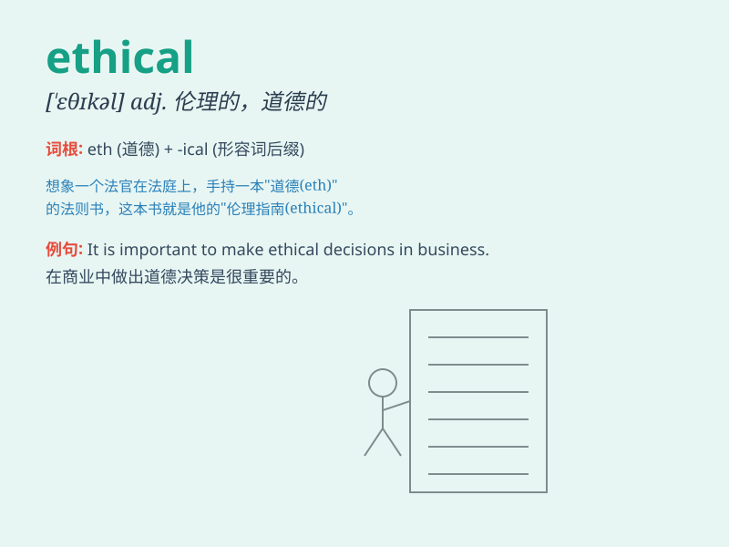

## ethical

**英音:** _[\'eθɪk(ə)l]_ **美音:** _[\'ɛθɪkl]_

**译义:** *adj.与伦理有关,民族的,民族特有的*

### 短语

+ **ethical dilemma:** _道德困境；伦理两难_

+ **ethical code:** _道德准则；伦理规范_

+ **ethical behavior:** _道德行为；伦理行为_

+ **ethical standard:** _道德标准；伦理标准_

+ **ethical issue:** _伦理问题；道德问题_

### 例句

#### 例句1

> **It is ethical to tell the truth in all circumstances.**

**中文翻译:** 在任何情况下说实话都是道德的。

**单词释义:** 合乎道德的

#### 例句2

> **The company has an ethical code of conduct for its employees.**

**中文翻译:** 公司为其员工制定了道德行为准则。

**单词释义:** 道德的

#### 例句3

> **We should make ethical decisions when facing difficult
choices.**

**中文翻译:** 当面临困难的选择时，我们应该做出符合道德的决定。

**单词释义:** 合乎道德的

### 背诵小故事

> A doctor was faced with a difficult choice. To prescribe a cheaper
but less effective drug for profit or an expensive but ethical one for
the patient\'s well-being. He chose the ethical option, showing his
integrity.

**一位医生面临着艰难的抉择。是为了盈利开一种便宜但效果较差的药，还是开一种昂贵但合乎道德的药以保障患者的健康。他选择了合乎道德的选项，展现了他的正直。**

### 图义

