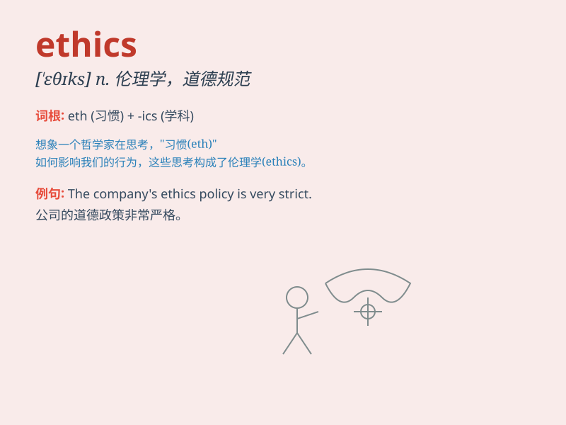

## ethics

**英音:** _[\'eθɪks]_ **美音:** _['ɛθɪks]_

**译义:** *n.偶尔,道德规范*

### 短语

+ **professional ethics:** _职业道德_

+ **medical ethics:** _医学伦理_

+ **business ethics:** _商业道德_

+ **ethical standards:** _道德标准_

+ **code of ethics:** _道德准则_

### 例句

#### 例句1

> **Medical ethics are extremely important in the healthcare
field.**

**中文翻译:** 医学道德在医疗保健领域极其重要。

**单词释义:** 伦理；道德规范

#### 例句2

> **Business ethics should be taught in schools to prepare students
for the workplace.**

**中文翻译:** 学校应教授商业道德，为学生进入工作场所做好准备。

**单词释义:** 伦理；道德规范

#### 例句3

> **The professor specializes in the study of ethics and moral
philosophy.**

**中文翻译:** 该教授专门研究伦理学和道德哲学。

**单词释义:** 伦理学；道德学

### 背诵小故事

> A scientist was facing a dilemma. Should he publish his research that
might have negative impacts? Remembering ethics, he chose to be honest
and consider the greater good. Ethics guided him to do the right thing.

**一位科学家面临困境。他应该发表可能有负面影响的研究成果吗？想起道德规范，他选择诚实并考虑更大的利益。道德指引他做正确的事。**

### 图义

