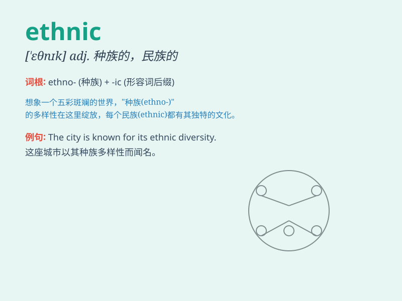

## ethnic

**英音:** _[\'eθnɪk]_ **美音:** _[\'ɛθnɪk]_

**译义:** *adj.人种的,种族的,异教徒的*

### 短语

+ **ethnic group:** _族群；民族_

+ **ethnic minority:** _少数民族_

+ **ethnic culture:** _民族文化_

+ **ethnic origin:** _种族本源；族裔出身_

+ **ethnic conflict:** _民族冲突_

### 例句

#### 例句1

> **The city has a rich ethnic diversity.**

**中文翻译:** 这个城市有着丰富的种族多样性。

**单词释义:** 民族的

#### 例句2

> **She is interested in ethnic music.**

**中文翻译:** 她对民族音乐感兴趣。

**单词释义:** 民族的

#### 例句3

> **Ethnic conflicts sometimes lead to violence.**

**中文翻译:** 种族冲突有时会导致暴力。

**单词释义:** 民族的

### 背诵小故事

> A group of friends from different ethnic backgrounds went on a trip.
They shared their unique cultures and had a wonderful time. \'Ethnic\'
means relating to a particular racial, national, or cultural group.

**一群来自不同民族背景的朋友去旅行。他们分享各自独特的文化，度过了美好时光。\'ethnic\'意思是与特定的种族、民族或文化群体有关。**

### 图义

