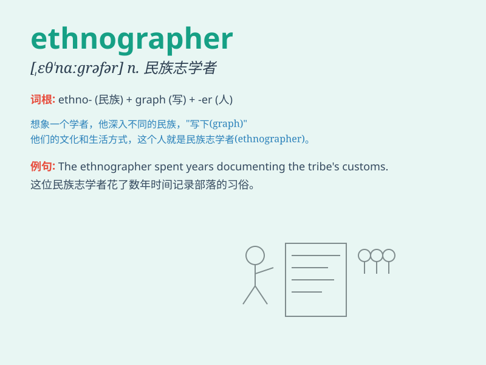

## ethnographer

**英音:** _[eθˈnɒɡrəfə(r)]_ **美音:** _[eθˈnɑːɡrəfər]_

**译义:** *n.民族志学者,人种学者*

### 短语

+ **cultural ethnographer:** _文化民族志学者_

+ **professional ethnographer:** _专业民族志学者_

+ **field ethnographer:** _实地民族志学者_

+ **social ethnographer:** _社会民族志学者_

+ **anthropological ethnographer:** _人类学民族志学者_

### 例句

#### 例句1

> **The ethnographer spent years studying the tribal culture.**

**中文翻译:** 这位民族志学家花了数年时间研究部落文化。

**单词释义:** 民族志学者

#### 例句2

> **She is a renowned ethnographer known for her in-depth
research.**

**中文翻译:** 她是一位著名的民族志学家，以其深入的研究而闻名。

**单词释义:** 民族志学者

#### 例句3

> **The ethnographer documented the daily lives of the villagers.**

**中文翻译:** 民族志学家记录了村民的日常生活。

**单词释义:** 民族志学者

### 背诵小故事

>
想象一下，有个勇敢的探险家叫艾利克斯，他热爱研究不同民族的文化，总是拿着笔记本记录，他就是一位
ethnographer（民族志学者），专门深入了解和描述各种民族的特点和生活方式。

**想象有个叫艾利克斯的探险家是民族志学者，专门研究记录不同民族文化，以此辅助记忆
ethnographer 这个单词**

### 图义

