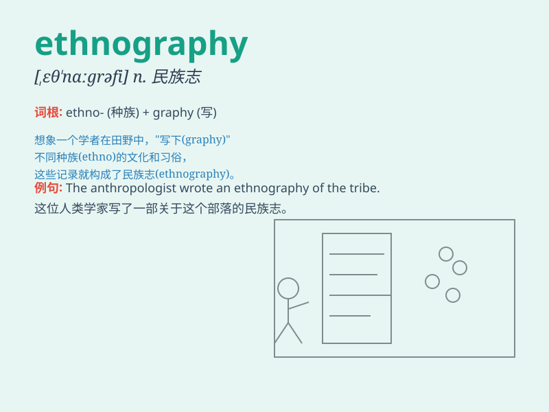

## ethnography

**英音:** _[eθ\'nɒgrəfɪ]_ **美音:** _[ɛθ\'nɑgrəfi]_

**译义:** *n.民族志学,人种学,人种志*

### 短语

+ **visual ethnography:** _视觉民族志_

+ **ethnography research:** _民族志研究_

+ **urban ethnography:** _城市民族志_

+ **digital ethnography:** _数字民族志_

+ **medical ethnography:** _医学民族志_

### 例句

#### 例句1

> **The anthropologist conducted extensive ethnography in the remote
village to understand the local culture.**

**中文翻译:**
人类学家在偏远的村庄进行了广泛的民族志研究，以了解当地的文化。

**单词释义:** 民族志；人种志

#### 例句2

> **Ethnography helps us gain insights into the diverse ways of life
of different communities.**

**中文翻译:** 民族志帮助我们深入了解不同社区的多样化生活方式。

**单词释义:** 民族志；人种志

#### 例句3

> **Her thesis was based on years of ethnography research in various
regions.**

**中文翻译:** 她的论文基于多年来在不同地区进行的民族志研究。

**单词释义:** 民族志；人种志

### 背诵小故事

> A young anthropologist was passionate about ethnography. He traveled
to remote tribes, observing their customs and documenting them. Through
this journey, he truly understood the essence of ethnography - the study
of different cultures.

**一位年轻的人类学家对民族志学充满热情。他前往偏远部落，观察他们的习俗并记录下来。通过这次旅程，他真正理解了民族志学------对不同文化的研究的本质。**

### 图义

