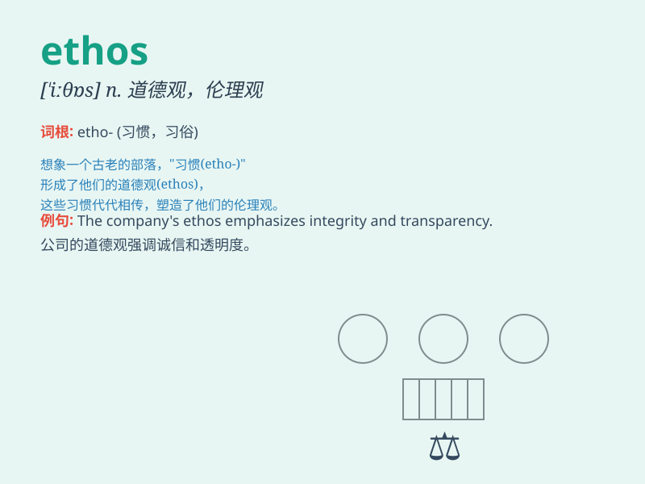

## ethos

**英音:** _[\'iːθɒs]_ **美音:** _[\'iθɑs]_

**译义:** *n.气质,道义,民族精神,社会思潮,风气*

### 短语

+ **corporate ethos:** _企业精神_

+ **national ethos:** _民族精神_

+ **academic ethos:** _学术风气_

+ **ethical ethos:** _道德风气_

+ **professional ethos:** _职业精神_

### 例句

#### 例句1

> **The ethos of this company is innovation and quality.**

**中文翻译:** 该公司的精神是创新和质量。

**单词释义:** 精神特质；道德风貌

#### 例句2

> **The school has a strong academic ethos.**

**中文翻译:** 学校具有浓厚的学术风气。

**单词释义:** 风气；思潮

#### 例句3

> **The ethos of the community is one of mutual support and
respect.**

**中文翻译:** 社区的精神是相互支持和尊重。

**单词释义:** 道德风气；社会思潮

### 背诵小故事

>
想象一个古老的部落，他们有着独特的精神和价值观，这种共同的精神气质就是他们的
ethos。它指引着部落成员的行为和决策，比如尊重长辈、勇敢面对困难。这就是
ethos 的含义------精神特质、气质。

**想象一个古老部落的独特精神和价值观，它指引成员行为决策，这就是"ethos"（精神特质、气质）的含义**

### 图义

