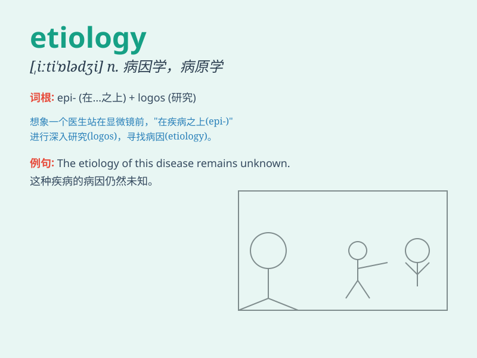

## etiology

**英音:** _[,iːtɪ\'ɒlədʒɪ]_ **美音:** _[,iti\'ɑlədʒi]_

**译义:** *n.[医]病因学,病源论*

### 短语

+ **pathogenic etiology:** _病原学病因_

+ **etiology research:** _病因学研究_

+ **unknown etiology:** _不明病因_

+ **etiology analysis:** _病因分析_

+ **study of etiology:** _病因学研究_

### 例句

#### 例句1

> **The etiology of the disease remains unknown.**

**中文翻译:** 该疾病的病因仍不清楚。

**单词释义:** 病因

#### 例句2

> **Researchers are studying the etiology of mental disorders.**

**中文翻译:** 研究人员正在研究精神障碍的病因。

**单词释义:** 病因

#### 例句3

> **Understanding the etiology of cancer is crucial for finding
effective treatments.**

**中文翻译:** 了解癌症的病因对于寻找有效的治疗方法至关重要。

**单词释义:** 病因

### 背诵小故事

> A detective was trying to solve a mysterious disease case. He focused
on the etiology, the cause of the illness. Finally, he found the root
cause and saved many lives. Remember, etiology means the cause or origin
of a disease or problem.

**一位侦探试图解决一个神秘的疾病案件。他专注于病因学，即疾病的成因。最终，他找到了根本原因并拯救了许多生命。记住，etiology
意思是疾病或问题的原因或起源。**

### 图义

