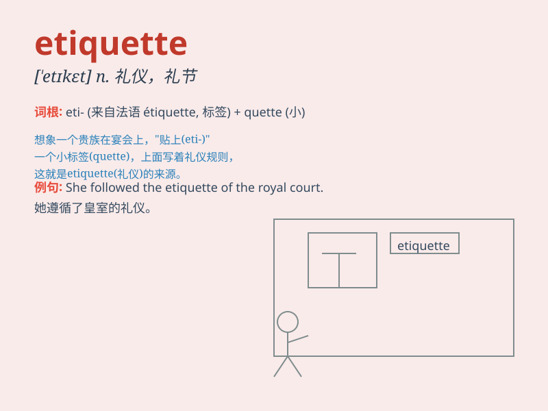

## etiquette

**英音:** _[\'etɪket; etɪ\'ket]_ **美音:** _[\'ɛtɪkɛt]_

**译义:** *n.礼节*

### 短语

+ **business etiquette:** _商务礼仪_

+ **social etiquette:** _社交礼仪_

+ **table etiquette:** _餐桌礼仪_

+ **etiquette rules:** _礼仪规则_

+ **etiquette training:** _礼仪培训_

### 例句

#### 例句1

> **Good etiquette is essential in a business meeting.**

**中文翻译:** 在商务会议中，良好的礼仪是必不可少的。

**单词释义:** 礼仪；礼节

#### 例句2

> **She was praised for her perfect etiquette at the dinner
party.**

**中文翻译:** 她在晚宴上因完美的礼仪而受到称赞。

**单词释义:** 礼仪；礼节

#### 例句3

> **The school teaches students the etiquette of social
interaction.**

**中文翻译:** 学校教授学生社交礼仪。

**单词释义:** 礼仪；礼节

### 背诵小故事

> A young man named Tom was always getting into trouble for bad
behavior. One day, a wise old man taught him about etiquette. Tom
learned to say \'please\' and \'thank you\', hold doors for others, and
follow social rules. From then on, he was known for his good etiquette.

**一个叫汤姆的年轻人总是因为不良行为惹上麻烦。有一天，一位睿智的老人教他礼仪。汤姆学会了说'请'和'谢谢'，为他人扶门，并遵循社会规则。从那以后，他因良好的礼仪而闻名。**

### 图义

