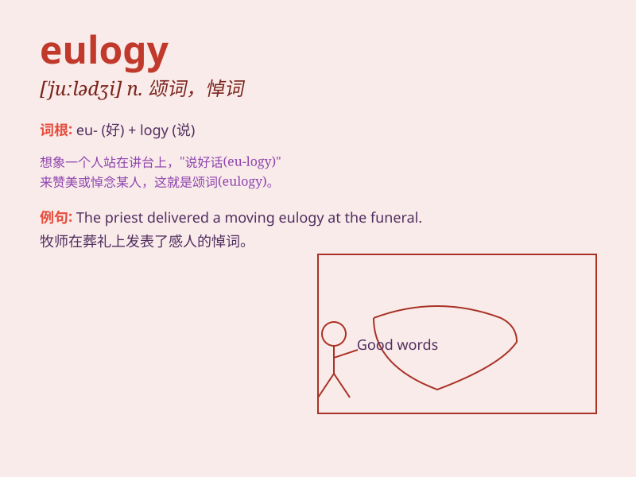

## eulogy

**英音:** _[\'juːlədʒɪ]_ **美音:** _[\'jʊlədʒi]_

**译义:** *n.赞词,颂词,歌功颂德的话*

### 短语

+ **deliver a eulogy:** _发表悼词_

+ **write a eulogy:** _写一篇颂词_

+ **heartfelt eulogy:** _衷心的颂词_

+ **moving eulogy:** _感人的悼词_

+ **eloquent eulogy:** _雄辩的颂词_

### 例句

#### 例句1

> **The president delivered a touching eulogy at the funeral of the
fallen soldier.**

**中文翻译:** 总统在阵亡士兵的葬礼上发表了感人的悼词。

**单词释义:** 颂词；悼词

#### 例句2

> **She wrote a beautiful eulogy for her late father.**

**中文翻译:** 她为已故的父亲写了一篇优美的悼词。

**单词释义:** 颂词；悼词

#### 例句3

> **The eulogy praised his kindness and generosity.**

**中文翻译:** 悼词赞扬了他的善良和慷慨。

**单词释义:** 颂词；赞扬

### 背诵小故事

> A king passed away. Everyone was sad. A wise man stood up and gave a
eulogy. He praised the king\'s kindness and wisdom. People listened
carefully and remembered the good things about the king.

**一位国王去世了。大家都很悲伤。一位智者站起来发表了颂词。他称赞国王的善良和智慧。人们认真聆听，记住了国王的美好。**

### 图义

