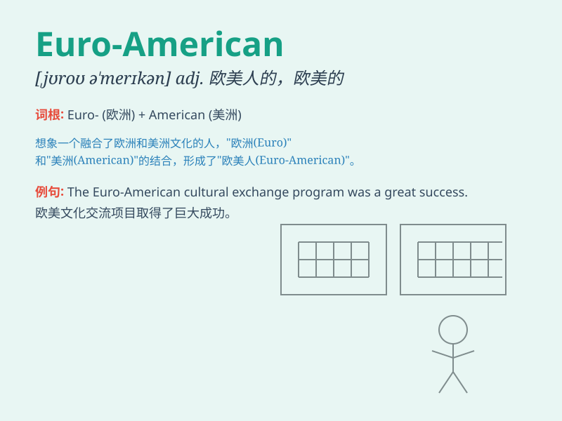

## Euro-American

**英音:** _[ˌjʊərəʊ əˈmerɪkən]_ **美音:** _[ˌjʊroʊ
əˈmerɪkən]_

**译义:** *n.欧裔美国人；adj.欧美（国家）的*

### 短语

+ **Euro-American culture:** _欧美文化_

+ **Euro-American relations:** _欧美关系_

+ **Euro-American literature:** _欧美文学_

+ **Euro-American style:** _欧美风格_

+ **Euro-American values:** _欧美价值观_

### 例句

#### 例句1

> **The Euro-American culture has a significant influence on global
trends.**

**中文翻译:** 欧美文化对全球趋势有着重大的影响。

**单词释义:** 欧美（的）

#### 例句2

> **Euro-American literature often explores themes of individualism
and freedom.**

**中文翻译:** 欧美文学经常探讨个人主义和自由的主题。

**单词释义:** 欧美（的）

#### 例句3

> **The Euro-American economic model faces various challenges in the
current era.**

**中文翻译:** 在当今时代，欧美经济模式面临着各种挑战。

**单词释义:** 欧美（的）

### 背诵小故事

> Once upon a time, a Euro-American traveler was exploring different
cultures. He had the charm of Europe and the spirit of America. His
journey showed the blend of these two great influences.

**从前，有一位欧裔美国人旅行者正在探索不同的文化。他有着欧洲的魅力和美国的精神。他的旅程展示了这两种巨大影响的融合。**

### 图义

