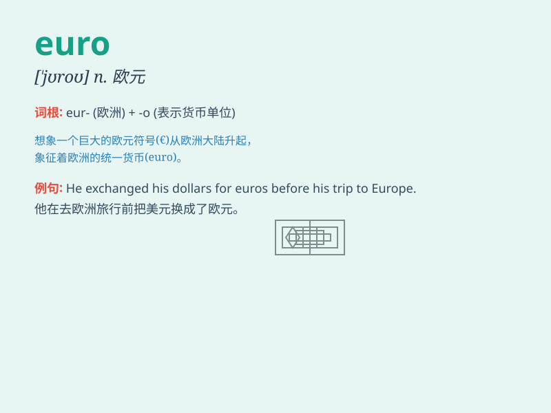

## euro

**英音:** _[\'jʊərəʊ]_ **美音:** _[\'jʊro]_

**译义:** *adj.=European n.[动]岩大袋鼠[澳洲土著语]*

### 短语

+ **euro zone:** _欧元区_

+ **euro currency:** _欧元货币_

+ **euro bill:** _欧元钞票_

+ **euro note:** _欧元纸币_

+ **euro coin:** _欧元硬币_

### 例句

#### 例句1

> **The price of this dress is 50 euros.**

**中文翻译:** 这件衣服的售价是50欧元。

**单词释义:** 欧元

#### 例句2

> **I exchanged my dollars for euros at the bank.**

**中文翻译:** 我在银行把美元兑换成欧元。

**单词释义:** 欧元

#### 例句3

> **The hotel room costs 100 euros per night.**

**中文翻译:** 酒店房间每晚收费100欧元。

**单词释义:** 欧元

### 背诵小故事

> A traveler went to Europe and needed euros to buy souvenirs. He
exchanged his money and got a stack of colorful euros. With these euros,
he had a great shopping spree.

**一位旅行者去欧洲，需要欧元来买纪念品。他兑换了货币，得到一叠五颜六色的欧元。凭借这些欧元，他尽情地购物。**

### 图义

