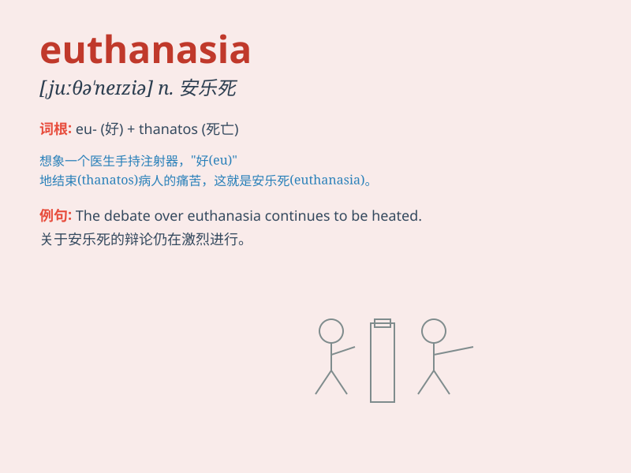

## euthanasia

**英音:** _[,juːθə\'neɪzɪə]_ **美音:** _[,juθə\'neʒə]_

**译义:** *n.安乐死*

### 短语

+ **active euthanasia:** _主动安乐死_

+ **passive euthanasia:** _被动安乐死_

+ **voluntary euthanasia:** _自愿安乐死_

+ **involuntary euthanasia:** _非自愿安乐死_

+ **euthanasia law:** _安乐死法_

### 例句

#### 例句1

> **Euthanasia is a controversial topic in many countries.**

**中文翻译:** 安乐死在许多国家都是一个有争议的话题。

**单词释义:** 安乐死

#### 例句2

> **Some people support euthanasia as a way to end unbearable
suffering.**

**中文翻译:** 有些人支持安乐死作为结束难以忍受的痛苦的一种方式。

**单词释义:** 安乐死

#### 例句3

> **The debate over euthanasia continues, with strong opinions on
both sides.**

**中文翻译:** 关于安乐死的争论仍在继续，双方都有强烈的意见。

**单词释义:** 安乐死

### 背诵小故事

> A terminally ill patient was in extreme pain. The doctor, facing the
dilemma, considered euthanasia. It means intentionally ending a
person\'s life to relieve suffering. But the decision was not easy.

**一位身患绝症的病人处于极度的痛苦之中。医生面对这个困境，考虑到了安乐死。它指的是有意结束一个人的生命以减轻其痛苦。但这个决定并不容易。**

### 图义

