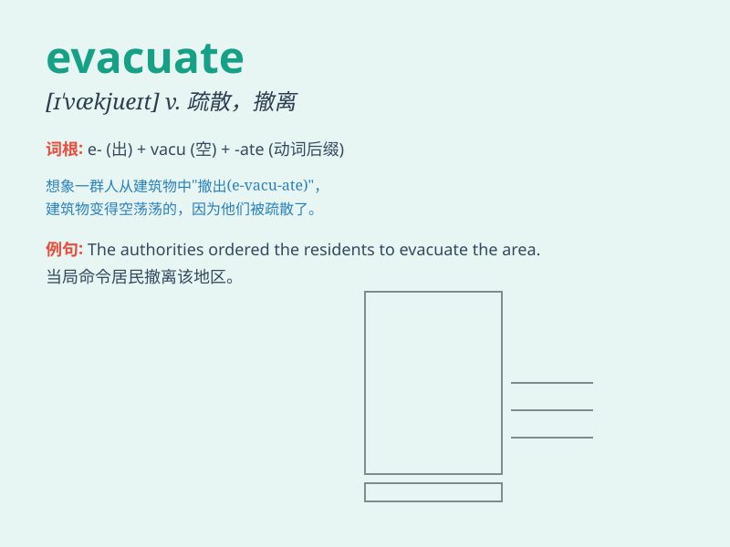

## evacuate

**英音:** _[ɪ\'vækjʊeɪt]_ **美音:** _[ɪ\'vækjuet]_

**译义:** *v.疏散,撤出,排泄*

### 短语

+ **evacuate quickly:** _迅速撤离_

+ **evacuate safely:** _安全撤离_

+ **evacuate the area:** _撤离该地区_

+ **evacuate people:** _疏散人员_

+ **be evacuated from:** _从\...\...撤离_

### 例句

#### 例句1

> **The residents were evacuated from the flood-stricken area.**

**中文翻译:** 洪水灾区的居民已被疏散。

**单词释义:** 撤离

#### 例句2

> **The hospital was evacuated due to a fire alarm.**

**中文翻译:** 由于火灾警报，医院被疏散。

**单词释义:** 疏散

#### 例句3

> **The soldiers were ordered to evacuate the wounded.**

**中文翻译:** 士兵们奉命疏散伤员。

**单词释义:** 转移

### 背诵小故事

> A fire broke out in the building. People were in panic. Luckily, the
firefighters came and shouted \'Evacuate!\' loudly. Everyone followed
the instructions and left the building safely.

**一座大楼里发生了火灾。人们惊慌失措。幸运的是，消防员来了并大声喊"疏散！"。每个人都听从指示，安全离开了大楼。**

### 图义

