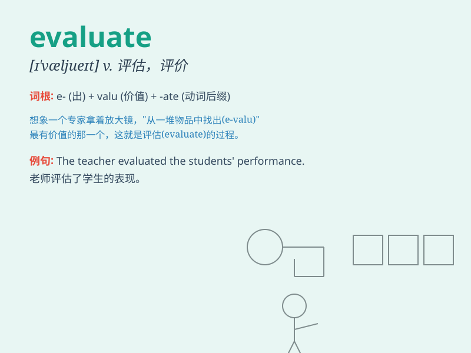

## evaluate

**英音:** _[ɪ\'væljʊeɪt]_ **美音:** _[ɪ\'væljʊ\'et]_

**译义:** *vt.评价,估计,求\...的值v.评价*

### 短语

+ **evaluate the situation:** _评估局势_

+ **evaluate the performance:** _评估表现_

+ **evaluate the evidence:** _评估证据_

+ **evaluate the proposal:** _评估提议_

+ **evaluate the options:** _评估选择_

### 例句

#### 例句1

> **The teacher will evaluate the students\' performance at the end
of the term.**

**中文翻译:** 老师将在学期末评估学生的表现。

**单词释义:** 评估

#### 例句2

> **It\'s difficult to evaluate the success of this project at this
stage.**

**中文翻译:** 在这个阶段很难评估这个项目的成功与否。

**单词释义:** 评估

#### 例句3

> **We need to evaluate the pros and cons before making a
decision.**

**中文翻译:** 在做决定之前，我们需要评估利弊。

**单词释义:** 评估

### 背诵小故事

> A king wanted to evaluate the skills of his knights. So, he set up a
series of challenges. The knights\' performance in these tests would
determine their worth. \'Evaluate\' means to judge or assess the value
or quality.

**一位国王想要评估他骑士们的技能。于是，他设置了一系列挑战。骑士们在这些测试中的表现将决定他们的价值。'evaluate'意思是判断或评定价值或质量。**

### 图义

