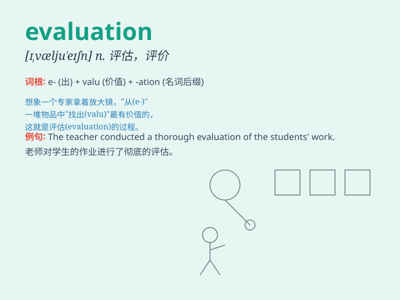

## evaluation

**英音:** _[ɪˌvæljuˈeɪʃn]_ **美音:** _[ɪ,væljʊ\'eʃən]_

**译义:** *n.估价,评价,赋值*

### 短语

+ **performance evaluation:** _绩效评估_

+ **evaluation method:** _评估方法_

+ **evaluation report:** _评估报告_

+ **evaluation criteria:** _评估标准_

+ **project evaluation:** _项目评估_

### 例句

#### 例句1

> **The evaluation of the new product was highly positive.**

**中文翻译:** 对这款新产品的评估是非常积极的。

**单词释义:** 评估；评价

#### 例句2

> **We need to conduct a thorough evaluation of the project\'s
progress.**

**中文翻译:** 我们需要对项目的进展进行彻底的评估。

**单词释义:** 评估；评价

#### 例句3

> **The teacher\'s evaluation of the student\'s performance was
fair.**

**中文翻译:** 老师对学生表现的评价是公平的。

**单词释义:** 评价

### 背诵小故事

> A student was very nervous about the evaluation of his project. But
when he got positive feedback, he realized that evaluation is not scary
but a helpful way to improve.

**一名学生对他项目的评估感到非常紧张。但当他得到积极的反馈时，他意识到评估并不可怕，而是一种有助于改进的方式。**

### 图义

