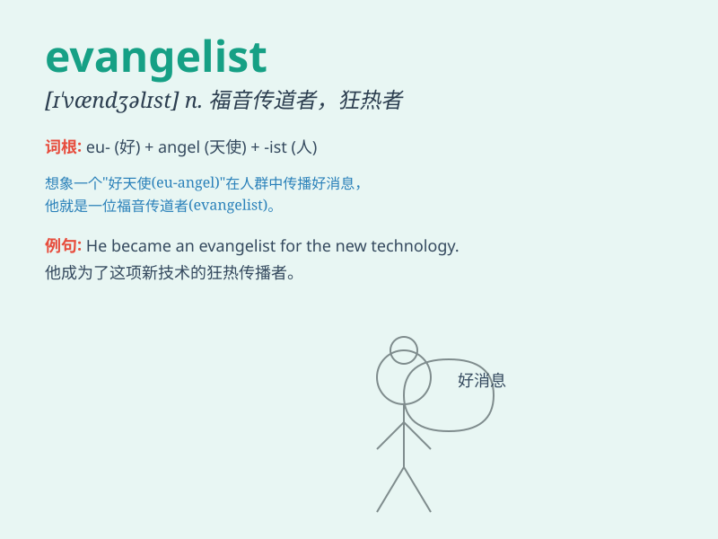

## evangelist

**英音:** _[ɪ\'væn(d)ʒ(ə)lɪst]_ **美音:**
_[ɪ\'vændʒəlɪst]_

**译义:** *n.圣经新约福音书的作者,福音传道者*

### 短语

+ **Christian evangelist:** _基督教布道者_

+ **technology evangelist:** _技术传播者_

+ **sales evangelist:** _销售宣传者_

+ **environmental evangelist:** _环保倡导者_

+ **digital evangelist:** _数字传道者_

### 例句

#### 例句1

> **The evangelist traveled from town to town, preaching the
gospel.**

**中文翻译:** 这位福音传道者从一个城镇到另一个城镇旅行，宣讲福音。

**单词释义:** 福音传道者

#### 例句2

> **She became an evangelist for environmental protection, inspiring
many to take action.**

**中文翻译:** 她成为了环境保护的倡导者，激励了许多人采取行动。

**单词释义:** 倡导者；传道者

#### 例句3

> **The technology evangelist spoke passionately about the potential
of artificial intelligence.**

**中文翻译:** 这位技术传道者热情地谈论了人工智能的潜力。

**单词释义:** 热情的倡导者；传道者

### 背诵小故事

>
想象一个热情的传教士（evangelist）在一个小村庄里，他每天带着圣经，挨家挨户地传播福音，用真诚和热情感染着每一个人，让他们感受到信仰的力量。

**想象一位传教士在村庄传播福音来辅助记忆\'evangelist\'这个单词，意思是传教士、福音传道者**

### 图义

