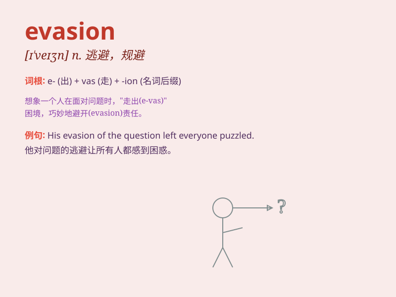

## evasion

**英音:** _[ɪ\'veɪʒ(ə)n]_ **美音:** _[ɪ\'veʒn]_

**译义:** *n.逃避,借口*

### 短语

+ **tax evasion:** _逃税；偷税_

+ **evasion of responsibility:** _逃避责任_

+ **evasion of duty:** _逃避义务_

+ **evasion tactics:** _逃避策略_

+ **evasion of reality:** _逃避现实_

### 例句

#### 例句1

> **His tax evasion led to a legal investigation.**

**中文翻译:** 他的逃税行为导致了法律调查。

**单词释义:** 逃税

#### 例句2

> **The criminal was skilled in evasion and managed to escape the
police several times.**

**中文翻译:** 这个罪犯善于躲避，好几次成功逃脱了警察的追捕。

**单词释义:** 躲避

#### 例句3

> **She used evasion tactics to avoid answering the difficult
question.**

**中文翻译:** 她使用回避策略来避免回答那个难题。

**单词释义:** 回避

### 背诵小故事

> A thief was always good at evasion. He could sneak away from the
police easily. But one day, he was finally caught. \'Evasion\' means
avoiding or escaping something, especially in a tricky or dishonest way.

**一个小偷总是很擅长逃避。他能轻易地从警察那里溜走。但有一天，他最终被抓住了。\'evasion\'意思是躲避或逃避某事，尤指以狡猾或不诚实的方式。**

### 图义

