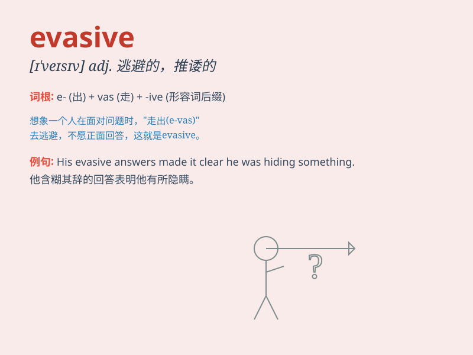

## evasive

**英音:** _[ɪ\'veɪsɪv]_ **美音:** _[ɪ\'vesɪv]_

**译义:** *adj.逃避的,推托的*

### 短语

+ **be evasive:** _含糊其辞；躲躲闪闪_

+ **evasive answer:** _含糊的回答；回避性的回答_

+ **evasive action:** _规避动作；躲避行动_

+ **evasive tactics:** _规避策略；逃避策略_

+ **evasive behavior:** _逃避行为；躲闪行为_

### 例句

#### 例句1

> **He gave evasive answers when asked about his plans for the
future.**

**中文翻译:** 当被问及他未来的计划时，他给出了含糊其辞的回答。

**单词释义:** 含糊的；回避的

#### 例句2

> **The politician was evasive on the issue of tax reform.**

**中文翻译:** 这位政治家在税收改革问题上闪烁其词。

**单词释义:** 避而不谈的；躲躲闪闪的

#### 例句3

> **Her evasive behavior made us suspicious.**

**中文翻译:** 她躲闪的行为让我们起了疑心。

**单词释义:** 逃避的；规避的

### 背诵小故事

> A thief was being questioned by the police. But he gave evasive
answers, avoiding telling the truth. He kept changing the topic and was
very tricky. Finally, the police saw through his evasive tactics.

**一个小偷正在接受警察的询问。但他给出了含糊其辞的回答，避免说出真相。他不断改变话题，非常狡猾。最后，警察看穿了他的逃避策略。**

### 图义

