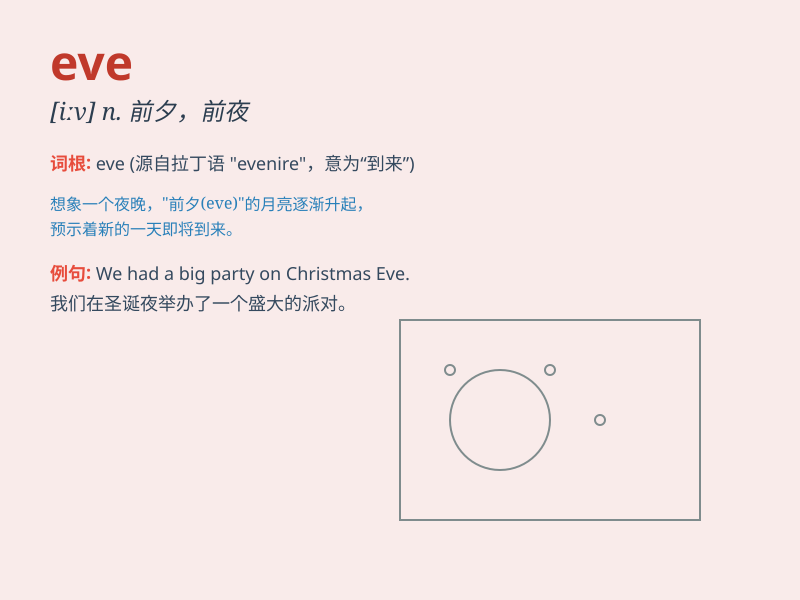

## eve

**英音:** _[iːv]_ **美音:** _[iːv]_

**译义:** *n.[诗]黄昏,前夕,前日 Eve 伊夫(女子名)*

### 短语

+ **Christmas Eve:** _圣诞前夕_

+ **New Year\'s Eve:** _新年前夕_

+ **on the eve of:** _在\...前夕_

+ **eve of war:** _战争前夕_

+ **eve of destruction:** _毁灭前夕_

### 例句

#### 例句1

> **On the eve of the exam, she was very nervous.**

**中文翻译:** 在考试前夕，她非常紧张。

**单词释义:** 前夕；前夜

#### 例句2

> **Christmas Eve is a time for family gatherings.**

**中文翻译:** 圣诞前夜是家庭团聚的时刻。

**单词释义:** 前夕；前夜

#### 例句3

> **The eve of the new year is always filled with excitement.**

**中文翻译:** 新年前夕总是充满了兴奋。

**单词释义:** 前夕；前夜

### 背诵小故事

> On the eve of the important exam, Eve was very nervous. She stayed up
late to review and hoped to get a good result. The next day, she felt
confident and did well.

**在重要考试的前夕，伊芙非常紧张。她熬夜复习并希望能取得好成绩。第二天，她感到自信并且表现出色。**

### 图义

