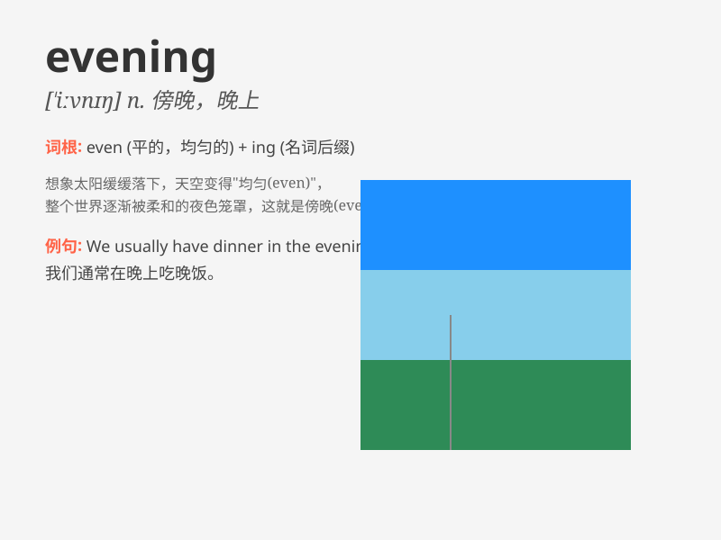

## evening

**英音:** _[\'iːv(ə)nɪŋ]_ **美音:** _[\'ivnɪŋ]_

**译义:** *n.傍晚,晚间,后期,(联欢性的)晚会*

### 短语

+ **good evening:** _晚上好（用于问候）_

+ **in the evening:** _在晚上_

+ **evening dress:** _晚礼服_

+ **evening class:** _夜校；晚自习_

+ **evening meal:** _晚餐_

### 例句

#### 例句1

> **I usually go for a walk in the evening.**

**中文翻译:** 我通常在晚上去散步。

**单词释义:** 晚上；傍晚

#### 例句2

> **The evening sky was filled with stars.**

**中文翻译:** 傍晚的天空布满了星星。

**单词释义:** 傍晚；黄昏

#### 例句3

> **We had a wonderful evening at the party.**

**中文翻译:** 我们在聚会上度过了一个美好的夜晚。

**单词释义:** 夜晚

### 背诵小故事

> One evening, a little girl was walking home. The sky was getting
darker, and the stars started to twinkle. She knew it was the time when
people finished their work and gathered with families. That\'s the magic
of evening.

**一天晚上，一个小女孩正走回家。天空越来越暗，星星开始闪烁。她知道这是人们完成工作并与家人相聚的时候。这就是夜晚的魅力。**

### 图义

