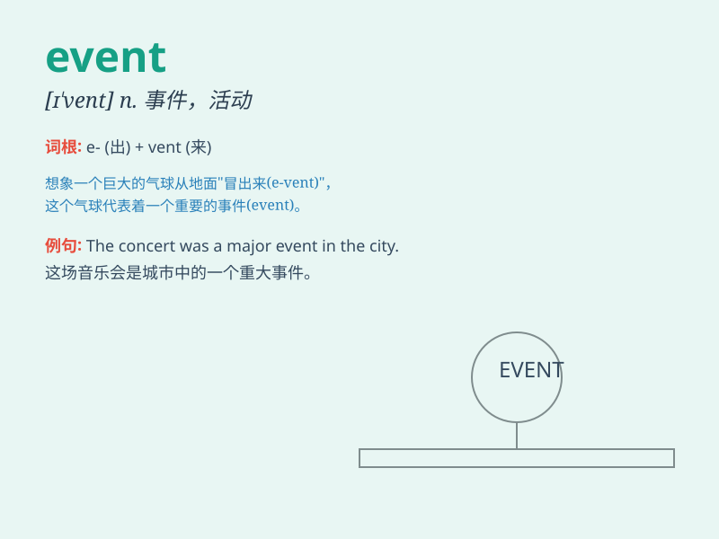

## event

**英音:** _[ɪ\'vent]_ **美音:** _[ɪ\'vɛnt]_

**译义:** *n.事件,事变,结果,活动,精力,竞赛*

### 短语

+ **in the event of:** _如果；万一_

+ **major event:** _重大事件_

+ **sporting event:** _体育赛事_

+ **historical event:** _历史事件_

+ **social event:** _社交活动_

### 例句

#### 例句1

> **The sports event attracted thousands of spectators.**

**中文翻译:** 这场体育赛事吸引了数千名观众。

**单词释义:** 赛事；活动

#### 例句2

> **In the event of rain, the concert will be postponed.**

**中文翻译:** 如果下雨，音乐会将延期。

**单词释义:** （尤指重要或不寻常的）事情，事件

#### 例句3

> **The event changed her life completely.**

**中文翻译:** 这件事彻底改变了她的生活。

**单词释义:** 事件；大事

### 背诵小故事

> One day, I was planning to go for a picnic. But suddenly, it rained
heavily. This unexpected rain was an event that changed my plan. I had
to stay at home instead.

**有一天，我正计划去野餐。但突然，下起了大雨。这场意外的雨是一个事件，改变了我的计划。我不得不待在家里。**

### 图义

