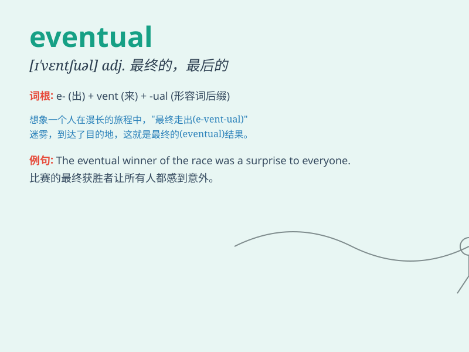

## eventual

**英音:** _[ɪˈventʃuəl]_ **美音:** _[ɪˈventʃuəl]_

**译义:** *adj.\<古>可能的,最后的,结局的,万一的,终于的,*

### 短语

+ **eventual outcome:** _最终结果_

+ **eventual success:** _最终的成功_

+ **eventual destination:** _最终目的地_

+ **eventual goal:** _最终目标_

+ **eventual winner:** _最终的获胜者_

### 例句

#### 例句1

> **The eventual outcome of the negotiations was a compromise.**

**中文翻译:** 谈判的最终结果是达成了妥协。

**单词释义:** 最终的

#### 例句2

> **We are waiting for the eventual success of the project.**

**中文翻译:** 我们正在等待这个项目的最终成功。

**单词释义:** 最终的

#### 例句3

> **His eventual goal is to become a doctor.**

**中文翻译:** 他的最终目标是成为一名医生。

**单词释义:** 最终的

### 背诵小故事

> A brave adventurer set out on a long journey. After facing many
challenges and detours, he finally reached his destination. This final
outcome was his eventual success.

**一位勇敢的冒险家踏上了漫长的旅程。在面对许多挑战和弯路之后，他最终到达了目的地。这个最终的结果就是他最终的成功。**

### 图义

